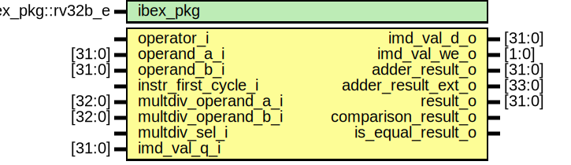

# Entity: ibex_alu

- **File**: ibex_alu.sv

## Diagram

## Generics

| Generic name | Type              | Value               | Description |
| ------------ | ----------------- | ------------------- | ----------- |
| ibex_pkg     | ibex_pkg::rv32b_e | ibex_pkg::RV32BNone |             |

## Ports

| Port name           | Direction | Type   | Description |
| ------------------- | --------- | ------ | ----------- |
| operator_i          | input     |        |             |
| operand_a_i         | input     | [31:0] |             |
| operand_b_i         | input     | [31:0] |             |
| instr_first_cycle_i | input     |        |             |
| multdiv_operand_a_i | input     | [32:0] |             |
| multdiv_operand_b_i | input     | [32:0] |             |
| multdiv_sel_i       | input     |        |             |
| imd_val_q_i         | input     | [31:0] |             |
| imd_val_d_o         | output    | [31:0] |             |
| imd_val_we_o        | output    | [1:0]  |             |
| adder_result_o      | output    | [31:0] |             |
| adder_result_ext_o  | output    | [33:0] |             |
| result_o            | output    | [31:0] |             |
| comparison_result_o | output    |        |             |
| is_equal_result_o   | output    |        |             |

## Signals

| Name                       | Type                | Description |
| -------------------------- | ------------------- | ----------- |
| operand_a_rev              | logic [31:0]        |             |
| operand_b_neg              | logic [32:0]        |             |
| adder_op_a_shift1          | logic               |             |
| adder_op_a_shift2          | logic               |             |
| adder_op_a_shift3          | logic               |             |
| adder_op_b_negate          | logic               |             |
| adder_in_a                 | logic [32:0]        |             |
| adder_in_b                 | logic [32:0]        |             |
| adder_result               | logic [31:0]        |             |
| is_equal                   | logic               |             |
| is_greater_equal           | logic               |             |
| cmp_signed                 | logic               |             |
| cmp_result                 | logic               |             |
| shift_left                 | logic               |             |
| shift_ones                 | logic               |             |
| shift_arith                | logic               |             |
| shift_funnel               | logic               |             |
| shift_sbmode               | logic               |             |
| shift_amt                  | logic [5:0]         |             |
| shift_amt_compl            | logic [5:0]         |             |
| shift_operand              | logic [31:0]        |             |
| shift_result_ext_signed    | logic signed [32:0] |             |
| shift_result_ext           | logic [32:0]        |             |
| unused_shift_result_ext    | logic               |             |
| shift_result               | logic [31:0]        |             |
| shift_result_rev           | logic [31:0]        |             |
| bfp_op                     | logic               |             |
| bfp_len                    | logic [4:0]         |             |
| bfp_off                    | logic [4:0]         |             |
| bfp_mask                   | logic [31:0]        |             |
| bfp_mask_rev               | logic [31:0]        |             |
| bfp_result                 | logic [31:0]        |             |
| bwlogic_or                 | logic               |             |
| bwlogic_and                | logic               |             |
| bwlogic_operand_b          | logic [31:0]        |             |
| bwlogic_or_result          | logic [31:0]        |             |
| bwlogic_and_result         | logic [31:0]        |             |
| bwlogic_xor_result         | logic [31:0]        |             |
| bwlogic_result             | logic [31:0]        |             |
| bwlogic_op_b_negate        | logic               |             |
| bitcnt_result              | logic [5:0]         |             |
| minmax_result              | logic [31:0]        |             |
| pack_result                | logic [31:0]        |             |
| sext_result                | logic [31:0]        |             |
| singlebit_result           | logic [31:0]        |             |
| rev_result                 | logic [31:0]        |             |
| shuffle_result             | logic [31:0]        |             |
| xperm_result               | logic [31:0]        |             |
| butterfly_result           | logic [31:0]        |             |
| invbutterfly_result        | logic [31:0]        |             |
| clmul_result               | logic [31:0]        |             |
| multicycle_result          | logic [31:0]        |             |
| g_no_alu_rvb               | end                 |             |
| unused_imd_val_q           | logic [31:0]        |             |
| unused_butterfly_result    | logic [31:0]        |             |
| unused_invbutterfly_result | logic [31:0]        |             |
| always_comb                | end                 |             |
| result_o                   | begin               |             |
| result_o                   | ALU_BFP             |             |
| end                        | endcase             |             |
| unused_shift_amt_compl     | logic               |             |

## Processes

- unnamed: ( )
  - **Type:** always_comb
- unnamed: ( )
  - **Type:** always_comb
- unnamed: ( )
  - **Type:** always_comb
- unnamed: ( )
  - **Type:** always_comb
- unnamed: ( )
  - **Type:** always_comb
- unnamed: ( )
  - **Type:** always_comb
- unnamed: ( )
  - **Type:** always_comb
- unnamed: ( )
  - **Type:** always_comb
- unnamed: ( )
  - **Type:** always_comb
- unnamed: ( )
  - **Type:** always_comb
- unnamed: ( )
  - **Type:** always_comb
- unnamed: ( )
  - **Type:** always_comb
