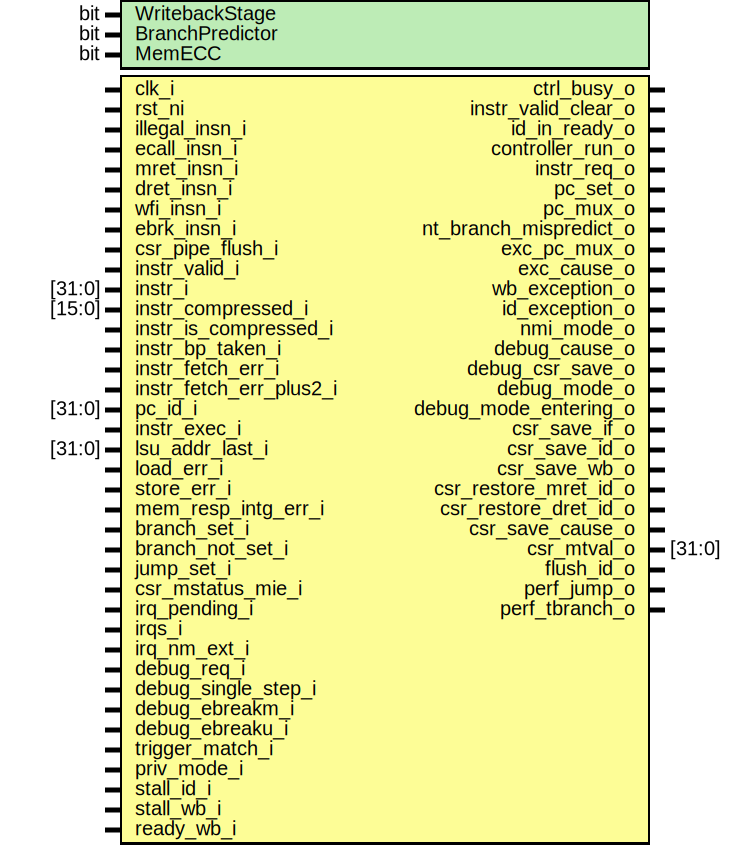
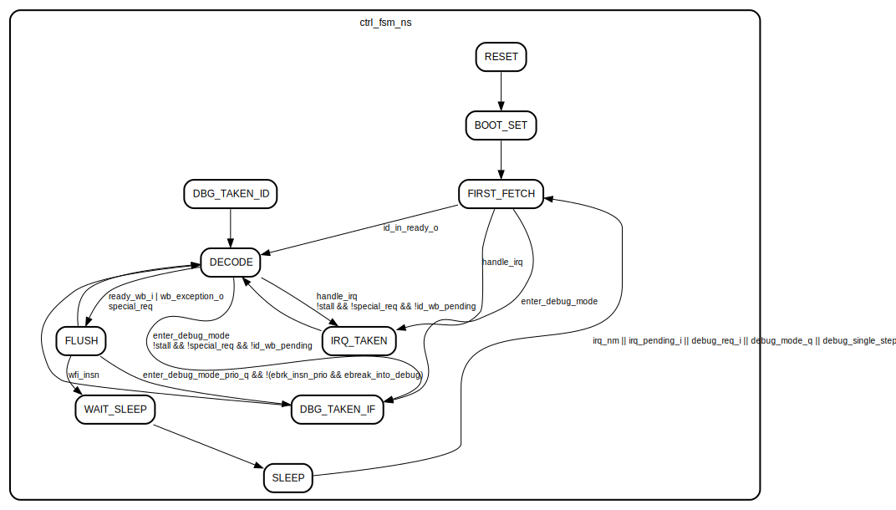

# Entity: ibex_controller

- **File**: ibex_controller.sv

## Diagram

## Generics

| Generic name    | Type | Value | Description |
| --------------- | ---- | ----- | ----------- |
| WritebackStage  | bit  | 1'b0  |             |
| BranchPredictor | bit  | 1'b0  |             |
| MemECC          | bit  | 1'b0  |             |

## Ports

| Port name               | Direction | Type   | Description |
| ----------------------- | --------- | ------ | ----------- |
| clk_i                   | input     |        |             |
| rst_ni                  | input     |        |             |
| ctrl_busy_o             | output    |        |             |
| illegal_insn_i          | input     |        |             |
| ecall_insn_i            | input     |        |             |
| mret_insn_i             | input     |        |             |
| dret_insn_i             | input     |        |             |
| wfi_insn_i              | input     |        |             |
| ebrk_insn_i             | input     |        |             |
| csr_pipe_flush_i        | input     |        |             |
| instr_valid_i           | input     |        |             |
| instr_i                 | input     | [31:0] |             |
| instr_compressed_i      | input     | [15:0] |             |
| instr_is_compressed_i   | input     |        |             |
| instr_bp_taken_i        | input     |        |             |
| instr_fetch_err_i       | input     |        |             |
| instr_fetch_err_plus2_i | input     |        |             |
| pc_id_i                 | input     | [31:0] |             |
| instr_valid_clear_o     | output    |        |             |
| id_in_ready_o           | output    |        |             |
| controller_run_o        | output    |        |             |
| instr_exec_i            | input     |        |             |
| instr_req_o             | output    |        |             |
| pc_set_o                | output    |        |             |
| pc_mux_o                | output    |        |             |
| nt_branch_mispredict_o  | output    |        |             |
| exc_pc_mux_o            | output    |        |             |
| exc_cause_o             | output    |        |             |
| lsu_addr_last_i         | input     | [31:0] |             |
| load_err_i              | input     |        |             |
| store_err_i             | input     |        |             |
| mem_resp_intg_err_i     | input     |        |             |
| wb_exception_o          | output    |        |             |
| id_exception_o          | output    |        |             |
| branch_set_i            | input     |        |             |
| branch_not_set_i        | input     |        |             |
| jump_set_i              | input     |        |             |
| csr_mstatus_mie_i       | input     |        |             |
| irq_pending_i           | input     |        |             |
| irqs_i                  | input     |        |             |
| irq_nm_ext_i            | input     |        |             |
| nmi_mode_o              | output    |        |             |
| debug_req_i             | input     |        |             |
| debug_cause_o           | output    |        |             |
| debug_csr_save_o        | output    |        |             |
| debug_mode_o            | output    |        |             |
| debug_mode_entering_o   | output    |        |             |
| debug_single_step_i     | input     |        |             |
| debug_ebreakm_i         | input     |        |             |
| debug_ebreaku_i         | input     |        |             |
| trigger_match_i         | input     |        |             |
| csr_save_if_o           | output    |        |             |
| csr_save_id_o           | output    |        |             |
| csr_save_wb_o           | output    |        |             |
| csr_restore_mret_id_o   | output    |        |             |
| csr_restore_dret_id_o   | output    |        |             |
| csr_save_cause_o        | output    |        |             |
| csr_mtval_o             | output    | [31:0] |             |
| priv_mode_i             | input     |        |             |
| stall_id_i              | input     |        |             |
| stall_wb_i              | input     |        |             |
| flush_id_o              | output    |        |             |
| ready_wb_i              | input     |        |             |
| perf_jump_o             | output    |        |             |
| perf_tbranch_o          | output    |        |             |

## Signals

| Name                       | Type                      | Description |
| -------------------------- | ------------------------- | ----------- |
| ctrl_fsm_cs                | ctrl_fsm_e                |             |
| ctrl_fsm_ns                | ctrl_fsm_e                |             |
| nmi_mode_q                 | logic                     |             |
| nmi_mode_d                 | logic                     |             |
| debug_mode_q               | logic                     |             |
| debug_mode_d               | logic                     |             |
| debug_cause_d              | dbg_cause_e               |             |
| debug_cause_q              | dbg_cause_e               |             |
| load_err_q                 | logic                     |             |
| load_err_d                 | logic                     |             |
| store_err_q                | logic                     |             |
| store_err_d                | logic                     |             |
| exc_req_q                  | logic                     |             |
| exc_req_d                  | logic                     |             |
| illegal_insn_q             | logic                     |             |
| illegal_insn_d             | logic                     |             |
| instr_fetch_err_prio       | logic                     |             |
| illegal_insn_prio          | logic                     |             |
| ecall_insn_prio            | logic                     |             |
| ebrk_insn_prio             | logic                     |             |
| store_err_prio             | logic                     |             |
| load_err_prio              | logic                     |             |
| stall                      | logic                     |             |
| halt_if                    | logic                     |             |
| retain_id                  | logic                     |             |
| flush_id                   | logic                     |             |
| exc_req_lsu                | logic                     |             |
| special_req                | logic                     |             |
| special_req_pc_change      | logic                     |             |
| special_req_flush_only     | logic                     |             |
| do_single_step_d           | logic                     |             |
| do_single_step_q           | logic                     |             |
| enter_debug_mode_prio_d    | logic                     |             |
| enter_debug_mode_prio_q    | logic                     |             |
| enter_debug_mode           | logic                     |             |
| ebreak_into_debug          | logic                     |             |
| irq_enabled                | logic                     |             |
| handle_irq                 | logic                     |             |
| id_wb_pending              | logic                     |             |
| irq_nm                     | logic                     |             |
| irq_nm_int                 | logic                     |             |
| irq_nm_int_mtval           | logic [31:0]              |             |
| irq_nm_int_cause           | ibex_pkg::nmi_int_cause_e |             |
| mfip_id                    | logic [3:0]               |             |
| unused_irq_timer           | logic                     |             |
| ecall_insn                 | logic                     |             |
| mret_insn                  | logic                     |             |
| dret_insn                  | logic                     |             |
| wfi_insn                   | logic                     |             |
| ebrk_insn                  | logic                     |             |
| csr_pipe_flush             | logic                     |             |
| instr_fetch_err            | logic                     |             |
| exception_req              | logic                     |             |
| exception_req_pending      | logic                     |             |
| exception_req_accepted     | logic                     |             |
| exception_req_done         | logic                     |             |
| exception_pc_set           | logic                     |             |
| seen_exception_pc_set      | logic                     |             |
| expect_exception_pc_set    | logic                     |             |
| exception_req_needs_pc_set | logic                     |             |
| rvfi_flush_next            | logic                     |             |

## Processes

- unnamed: ( @(negedge clk_i) )
  - **Type:** always_ff
- gen_mfip_id: ( )
  - **Type:** always_comb
- unnamed: ( @(posedge clk_i or negedge rst_ni) )
  - **Type:** always_ff
- unnamed: ( )
  - **Type:** always_comb
- update_regs: ( @(posedge clk_i or negedge rst_ni) )
  - **Type:** always_ff
- unnamed: ( @(posedge clk_i or negedge rst_ni) )
  - **Type:** always

## State machines

