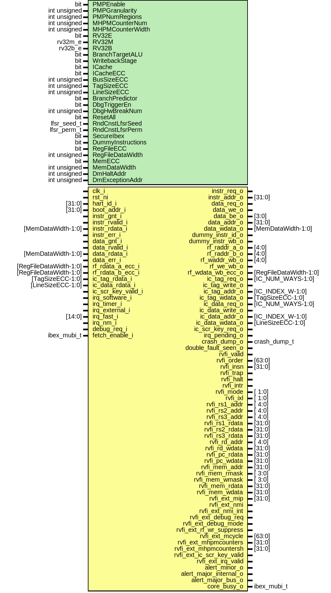

# Entity: ibex_core

- **File**: ibex_core.sv

## Diagram

## Generics

| Generic name      | Type         | Value                  | Description |
| ----------------- | ------------ | ---------------------- | ----------- |
| PMPEnable         | bit          | 1'b0                   |             |
| PMPGranularity    | int unsigned | 0                      |             |
| PMPNumRegions     | int unsigned | 4                      |             |
| MHPMCounterNum    | int unsigned | 0                      |             |
| MHPMCounterWidth  | int unsigned | 40                     |             |
| RV32E             | bit          | 1'b0                   |             |
| RV32M             | rv32m_e      | RV32MFast              |             |
| RV32B             | rv32b_e      | RV32BNone              |             |
| BranchTargetALU   | bit          | 1'b0                   |             |
| WritebackStage    | bit          | 1'b0                   |             |
| ICache            | bit          | 1'b0                   |             |
| ICacheECC         | bit          | 1'b0                   |             |
| BusSizeECC        | int unsigned | BUS_SIZE               |             |
| TagSizeECC        | int unsigned | IC_TAG_SIZE            |             |
| LineSizeECC       | int unsigned | IC_LINE_SIZE           |             |
| BranchPredictor   | bit          | 1'b0                   |             |
| DbgTriggerEn      | bit          | 1'b0                   |             |
| DbgHwBreakNum     | int unsigned | 1                      |             |
| ResetAll          | bit          | 1'b0                   |             |
| RndCnstLfsrSeed   | lfsr_seed_t  | RndCnstLfsrSeedDefault |             |
| RndCnstLfsrPerm   | lfsr_perm_t  | RndCnstLfsrPermDefault |             |
| SecureIbex        | bit          | 1'b0                   |             |
| DummyInstructions | bit          | 1'b0                   |             |
| RegFileECC        | bit          | 1'b0                   |             |
| RegFileDataWidth  | int unsigned | 32                     |             |
| MemECC            | bit          | 1'b0                   |             |
| MemDataWidth      | int unsigned | 32 + 7                 |             |
| DmHaltAddr        | int unsigned | 32'h1A110800           |             |
| DmExceptionAddr   | int unsigned | 32'h1A110808           |             |

## Ports

| Port name                 | Direction | Type                   | Description |
| ------------------------- | --------- | ---------------------- | ----------- |
| clk_i                     | input     |                        |             |
| rst_ni                    | input     |                        |             |
| hart_id_i                 | input     | [31:0]                 |             |
| boot_addr_i               | input     | [31:0]                 |             |
| instr_req_o               | output    |                        |             |
| instr_gnt_i               | input     |                        |             |
| instr_rvalid_i            | input     |                        |             |
| instr_addr_o              | output    | [31:0]                 |             |
| instr_rdata_i             | input     | [MemDataWidth-1:0]     |             |
| instr_err_i               | input     |                        |             |
| data_req_o                | output    |                        |             |
| data_gnt_i                | input     |                        |             |
| data_rvalid_i             | input     |                        |             |
| data_we_o                 | output    |                        |             |
| data_be_o                 | output    | [3:0]                  |             |
| data_addr_o               | output    | [31:0]                 |             |
| data_wdata_o              | output    | [MemDataWidth-1:0]     |             |
| data_rdata_i              | input     | [MemDataWidth-1:0]     |             |
| data_err_i                | input     |                        |             |
| dummy_instr_id_o          | output    |                        |             |
| dummy_instr_wb_o          | output    |                        |             |
| rf_raddr_a_o              | output    | [4:0]                  |             |
| rf_raddr_b_o              | output    | [4:0]                  |             |
| rf_waddr_wb_o             | output    | [4:0]                  |             |
| rf_we_wb_o                | output    |                        |             |
| rf_wdata_wb_ecc_o         | output    | [RegFileDataWidth-1:0] |             |
| rf_rdata_a_ecc_i          | input     | [RegFileDataWidth-1:0] |             |
| rf_rdata_b_ecc_i          | input     | [RegFileDataWidth-1:0] |             |
| ic_tag_req_o              | output    | [IC_NUM_WAYS-1:0]      |             |
| ic_tag_write_o            | output    |                        |             |
| ic_tag_addr_o             | output    | [IC_INDEX_W-1:0]       |             |
| ic_tag_wdata_o            | output    | [TagSizeECC-1:0]       |             |
| ic_tag_rdata_i            | input     | [TagSizeECC-1:0]       |             |
| ic_data_req_o             | output    | [IC_NUM_WAYS-1:0]      |             |
| ic_data_write_o           | output    |                        |             |
| ic_data_addr_o            | output    | [IC_INDEX_W-1:0]       |             |
| ic_data_wdata_o           | output    | [LineSizeECC-1:0]      |             |
| ic_data_rdata_i           | input     | [LineSizeECC-1:0]      |             |
| ic_scr_key_valid_i        | input     |                        |             |
| ic_scr_key_req_o          | output    |                        |             |
| irq_software_i            | input     |                        |             |
| irq_timer_i               | input     |                        |             |
| irq_external_i            | input     |                        |             |
| irq_fast_i                | input     | [14:0]                 |             |
| irq_nm_i                  | input     |                        |             |
| irq_pending_o             | output    |                        |             |
| debug_req_i               | input     |                        |             |
| crash_dump_o              | output    | crash_dump_t           |             |
| double_fault_seen_o       | output    |                        |             |
| rvfi_valid                | output    |                        |             |
| rvfi_order                | output    | [63:0]                 |             |
| rvfi_insn                 | output    | [31:0]                 |             |
| rvfi_trap                 | output    |                        |             |
| rvfi_halt                 | output    |                        |             |
| rvfi_intr                 | output    |                        |             |
| rvfi_mode                 | output    | [ 1:0]                 |             |
| rvfi_ixl                  | output    | [ 1:0]                 |             |
| rvfi_rs1_addr             | output    | [ 4:0]                 |             |
| rvfi_rs2_addr             | output    | [ 4:0]                 |             |
| rvfi_rs3_addr             | output    | [ 4:0]                 |             |
| rvfi_rs1_rdata            | output    | [31:0]                 |             |
| rvfi_rs2_rdata            | output    | [31:0]                 |             |
| rvfi_rs3_rdata            | output    | [31:0]                 |             |
| rvfi_rd_addr              | output    | [ 4:0]                 |             |
| rvfi_rd_wdata             | output    | [31:0]                 |             |
| rvfi_pc_rdata             | output    | [31:0]                 |             |
| rvfi_pc_wdata             | output    | [31:0]                 |             |
| rvfi_mem_addr             | output    | [31:0]                 |             |
| rvfi_mem_rmask            | output    | [ 3:0]                 |             |
| rvfi_mem_wmask            | output    | [ 3:0]                 |             |
| rvfi_mem_rdata            | output    | [31:0]                 |             |
| rvfi_mem_wdata            | output    | [31:0]                 |             |
| rvfi_ext_mip              | output    | [31:0]                 |             |
| rvfi_ext_nmi              | output    |                        |             |
| rvfi_ext_nmi_int          | output    |                        |             |
| rvfi_ext_debug_req        | output    |                        |             |
| rvfi_ext_debug_mode       | output    |                        |             |
| rvfi_ext_rf_wr_suppress   | output    |                        |             |
| rvfi_ext_mcycle           | output    | [63:0]                 |             |
| rvfi_ext_mhpmcounters     | output    | [31:0]                 |             |
| rvfi_ext_mhpmcountersh    | output    | [31:0]                 |             |
| rvfi_ext_ic_scr_key_valid | output    |                        |             |
| rvfi_ext_irq_valid        | output    |                        |             |
| fetch_enable_i            | input     | ibex_mubi_t            |             |
| alert_minor_o             | output    |                        |             |
| alert_major_internal_o    | output    |                        |             |
| alert_major_bus_o         | output    |                        |             |
| core_busy_o               | output    | ibex_mubi_t            |             |

## Signals

| Name                              | Type             | Description |
| --------------------------------- | ---------------- | ----------- |
| dummy_instr_id                    | logic            |             |
| instr_valid_id                    | logic            |             |
| instr_new_id                      | logic            |             |
| instr_rdata_id                    | logic [31:0]     |             |
| instr_rdata_alu_id                | logic [31:0]     |             |
| instr_rdata_c_id                  | logic [15:0]     |             |
| instr_is_compressed_id            | logic            |             |
| instr_perf_count_id               | logic            |             |
| instr_bp_taken_id                 | logic            |             |
| instr_fetch_err                   | logic            |             |
| instr_fetch_err_plus2             | logic            |             |
| illegal_c_insn_id                 | logic            |             |
| pc_if                             | logic [31:0]     |             |
| pc_id                             | logic [31:0]     |             |
| pc_wb                             | logic [31:0]     |             |
| imd_val_d_ex                      | logic [33:0]     |             |
| imd_val_q_ex                      | logic [33:0]     |             |
| imd_val_we_ex                     | logic [1:0]      |             |
| data_ind_timing                   | logic            |             |
| dummy_instr_en                    | logic            |             |
| dummy_instr_mask                  | logic [2:0]      |             |
| dummy_instr_seed_en               | logic            |             |
| dummy_instr_seed                  | logic [31:0]     |             |
| icache_enable                     | logic            |             |
| icache_inval                      | logic            |             |
| icache_ecc_error                  | logic            |             |
| pc_mismatch_alert                 | logic            |             |
| csr_shadow_err                    | logic            |             |
| instr_first_cycle_id              | logic            |             |
| instr_valid_clear                 | logic            |             |
| pc_set                            | logic            |             |
| nt_branch_mispredict              | logic            |             |
| nt_branch_addr                    | logic [31:0]     |             |
| pc_mux_id                         | pc_sel_e         |             |
| exc_pc_mux_id                     | exc_pc_sel_e     |             |
| exc_cause                         | exc_cause_t      |             |
| instr_intg_err                    | logic            |             |
| lsu_load_err                      | logic            |             |
| lsu_store_err                     | logic            |             |
| lsu_load_resp_intg_err            | logic            |             |
| lsu_store_resp_intg_err           | logic            |             |
| lsu_addr_incr_req                 | logic            |             |
| lsu_addr_last                     | logic [31:0]     |             |
| branch_target_ex                  | logic [31:0]     |             |
| branch_decision                   | logic            |             |
| ctrl_busy                         | logic            |             |
| if_busy                           | logic            |             |
| lsu_busy                          | logic            |             |
| rf_raddr_a                        | logic [4:0]      |             |
| rf_rdata_a                        | logic [31:0]     |             |
| rf_raddr_b                        | logic [4:0]      |             |
| rf_rdata_b                        | logic [31:0]     |             |
| rf_ren_a                          | logic            |             |
| rf_ren_b                          | logic            |             |
| rf_waddr_wb                       | logic [4:0]      |             |
| rf_wdata_wb                       | logic [31:0]     |             |
| rf_wdata_fwd_wb                   | logic [31:0]     |             |
| rf_wdata_lsu                      | logic [31:0]     |             |
| rf_we_wb                          | logic            |             |
| rf_we_lsu                         | logic            |             |
| rf_ecc_err_comb                   | logic            |             |
| rf_waddr_id                       | logic [4:0]      |             |
| rf_wdata_id                       | logic [31:0]     |             |
| rf_we_id                          | logic            |             |
| rf_rd_a_wb_match                  | logic            |             |
| rf_rd_b_wb_match                  | logic            |             |
| alu_operator_ex                   | alu_op_e         |             |
| alu_operand_a_ex                  | logic [31:0]     |             |
| alu_operand_b_ex                  | logic [31:0]     |             |
| bt_a_operand                      | logic [31:0]     |             |
| bt_b_operand                      | logic [31:0]     |             |
| alu_adder_result_ex               | logic [31:0]     |             |
| result_ex                         | logic [31:0]     |             |
| mult_en_ex                        | logic            |             |
| div_en_ex                         | logic            |             |
| mult_sel_ex                       | logic            |             |
| div_sel_ex                        | logic            |             |
| multdiv_operator_ex               | md_op_e          |             |
| multdiv_signed_mode_ex            | logic [1:0]      |             |
| multdiv_operand_a_ex              | logic [31:0]     |             |
| multdiv_operand_b_ex              | logic [31:0]     |             |
| multdiv_ready_id                  | logic            |             |
| csr_access                        | logic            |             |
| csr_op                            | csr_op_e         |             |
| csr_op_en                         | logic            |             |
| csr_addr                          | csr_num_e        |             |
| csr_rdata                         | logic [31:0]     |             |
| csr_wdata                         | logic [31:0]     |             |
| illegal_csr_insn_id               | logic            |             |
| lsu_we                            | logic            |             |
| lsu_type                          | logic [1:0]      |             |
| lsu_sign_ext                      | logic            |             |
| lsu_req                           | logic            |             |
| lsu_wdata                         | logic [31:0]     |             |
| lsu_req_done                      | logic            |             |
| id_in_ready                       | logic            |             |
| ex_valid                          | logic            |             |
| lsu_resp_valid                    | logic            |             |
| lsu_resp_err                      | logic            |             |
| instr_req_int                     | logic            |             |
| instr_req_gated                   | logic            |             |
| instr_exec                        | logic            |             |
| en_wb                             | logic            |             |
| instr_type_wb                     | wb_instr_type_e  |             |
| ready_wb                          | logic            |             |
| rf_write_wb                       | logic            |             |
| outstanding_load_wb               | logic            |             |
| outstanding_store_wb              | logic            |             |
| dummy_instr_wb                    | logic            |             |
| nmi_mode                          | logic            |             |
| irqs                              | irqs_t           |             |
| csr_mstatus_mie                   | logic            |             |
| csr_mepc                          | logic [31:0]     |             |
| csr_depc                          | logic [31:0]     |             |
| csr_pmp_addr                      | logic [33:0]     |             |
| csr_pmp_cfg                       | pmp_cfg_t        |             |
| csr_pmp_mseccfg                   | pmp_mseccfg_t    |             |
| pmp_req_err                       | logic            |             |
| data_req_out                      | logic            |             |
| csr_save_if                       | logic            |             |
| csr_save_id                       | logic            |             |
| csr_save_wb                       | logic            |             |
| csr_restore_mret_id               | logic            |             |
| csr_restore_dret_id               | logic            |             |
| csr_save_cause                    | logic            |             |
| csr_mtvec_init                    | logic            |             |
| csr_mtvec                         | logic [31:0]     |             |
| csr_mtval                         | logic [31:0]     |             |
| csr_mstatus_tw                    | logic            |             |
| priv_mode_id                      | priv_lvl_e       |             |
| priv_mode_lsu                     | priv_lvl_e       |             |
| debug_mode                        | logic            |             |
| debug_mode_entering               | logic            |             |
| debug_cause                       | dbg_cause_e      |             |
| debug_csr_save                    | logic            |             |
| debug_single_step                 | logic            |             |
| debug_ebreakm                     | logic            |             |
| debug_ebreaku                     | logic            |             |
| trigger_match                     | logic            |             |
| instr_id_done                     | logic            |             |
| instr_done_wb                     | logic            |             |
| perf_instr_ret_wb                 | logic            |             |
| perf_instr_ret_compressed_wb      | logic            |             |
| perf_instr_ret_wb_spec            | logic            |             |
| perf_instr_ret_compressed_wb_spec | logic            |             |
| perf_iside_wait                   | logic            |             |
| perf_dside_wait                   | logic            |             |
| perf_mul_wait                     | logic            |             |
| perf_div_wait                     | logic            |             |
| perf_jump                         | logic            |             |
| perf_branch                       | logic            |             |
| perf_tbranch                      | logic            |             |
| perf_load                         | logic            |             |
| perf_store                        | logic            |             |
| illegal_insn_id                   | logic            |             |
| unused_illegal_insn_id            | logic            |             |
| g_core_busy_non_secure            | end              |             |
| crash_dump_mtval                  | logic [31:0]     |             |
| outstanding_load_resp             | logic            |             |
| outstanding_store_resp            | logic            |             |
| outstanding_load_id               | logic            |             |
| outstanding_store_id              | logic            |             |
| pc_at_fetch_disable               | logic [31:0]     |             |
| last_fetch_enable                 | ibex_mubi_t      |             |
| rvfi_stage_valid                  | logic            |             |
| rvfi_stage_order                  | logic [63:0]     |             |
| rvfi_stage_insn                   | logic [31:0]     |             |
| rvfi_stage_trap                   | logic            |             |
| rvfi_stage_halt                   | logic            |             |
| rvfi_stage_intr                   | logic            |             |
| rvfi_stage_mode                   | logic [ 1:0]     |             |
| rvfi_stage_ixl                    | logic [ 1:0]     |             |
| rvfi_stage_rs1_addr               | logic [ 4:0]     |             |
| rvfi_stage_rs2_addr               | logic [ 4:0]     |             |
| rvfi_stage_rs3_addr               | logic [ 4:0]     |             |
| rvfi_stage_rs1_rdata              | logic [31:0]     |             |
| rvfi_stage_rs2_rdata              | logic [31:0]     |             |
| rvfi_stage_rs3_rdata              | logic [31:0]     |             |
| rvfi_stage_rd_addr                | logic [ 4:0]     |             |
| rvfi_stage_rd_wdata               | logic [31:0]     |             |
| rvfi_stage_pc_rdata               | logic [31:0]     |             |
| rvfi_stage_pc_wdata               | logic [31:0]     |             |
| rvfi_stage_mem_addr               | logic [31:0]     |             |
| rvfi_stage_mem_rmask              | logic [ 3:0]     |             |
| rvfi_stage_mem_wmask              | logic [ 3:0]     |             |
| rvfi_stage_mem_rdata              | logic [31:0]     |             |
| rvfi_stage_mem_wdata              | logic [31:0]     |             |
| rvfi_instr_new_wb                 | logic            |             |
| rvfi_intr_d                       | logic            |             |
| rvfi_intr_q                       | logic            |             |
| rvfi_set_trap_pc_d                | logic            |             |
| rvfi_set_trap_pc_q                | logic            |             |
| rvfi_insn_id                      | logic [31:0]     |             |
| rvfi_rs1_addr_d                   | logic [4:0]      |             |
| rvfi_rs1_addr_q                   | logic [4:0]      |             |
| rvfi_rs2_addr_d                   | logic [4:0]      |             |
| rvfi_rs2_addr_q                   | logic [4:0]      |             |
| rvfi_rs3_addr_d                   | logic [4:0]      |             |
| rvfi_rs1_data_d                   | logic [31:0]     |             |
| rvfi_rs1_data_q                   | logic [31:0]     |             |
| rvfi_rs2_data_d                   | logic [31:0]     |             |
| rvfi_rs2_data_q                   | logic [31:0]     |             |
| rvfi_rs3_data_d                   | logic [31:0]     |             |
| rvfi_rd_addr_wb                   | logic [4:0]      |             |
| rvfi_rd_addr_q                    | logic [4:0]      |             |
| rvfi_rd_addr_d                    | logic [4:0]      |             |
| rvfi_rd_wdata_wb                  | logic [31:0]     |             |
| rvfi_rd_wdata_d                   | logic [31:0]     |             |
| rvfi_rd_wdata_q                   | logic [31:0]     |             |
| rvfi_rd_we_wb                     | logic            |             |
| rvfi_mem_mask_int                 | logic [3:0]      |             |
| rvfi_mem_rdata_d                  | logic [31:0]     |             |
| rvfi_mem_rdata_q                  | logic [31:0]     |             |
| rvfi_mem_wdata_d                  | logic [31:0]     |             |
| rvfi_mem_wdata_q                  | logic [31:0]     |             |
| rvfi_mem_addr_d                   | logic [31:0]     |             |
| rvfi_mem_addr_q                   | logic [31:0]     |             |
| rvfi_trap_id                      | logic            |             |
| rvfi_trap_wb                      | logic            |             |
| rvfi_irq_valid                    | logic            |             |
| rvfi_stage_order_d                | logic [63:0]     |             |
| rvfi_id_done                      | logic            |             |
| rvfi_wb_done                      | logic            |             |
| new_debug_req                     | logic            |             |
| new_nmi                           | logic            |             |
| new_nmi_int                       | logic            |             |
| new_irq                           | logic            |             |
| captured_mip                      | ibex_pkg::irqs_t |             |
| captured_nmi                      | logic            |             |
| captured_nmi_int                  | logic            |             |
| captured_debug_req                | logic            |             |
| captured_valid                    | logic            |             |
| rvfi_ext_stage_mip                | ibex_pkg::irqs_t |             |
| rvfi_ext_stage_nmi                | logic            |             |
| rvfi_ext_stage_nmi_int            | logic            |             |
| rvfi_ext_stage_debug_req          | logic            |             |
| rvfi_ext_stage_debug_mode         | logic            |             |
| rvfi_ext_stage_mcycle             | logic [63:0]     |             |
| rvfi_ext_stage_mhpmcounters       | logic [31:0]     |             |
| rvfi_ext_stage_mhpmcountersh      | logic [31:0]     |             |
| rvfi_ext_stage_ic_scr_key_valid   | logic            |             |
| rvfi_ext_stage_irq_valid          | logic            |             |
| rvfi_stage_valid_d                | logic            |             |
| unused_instr_new_id               | logic            |             |
| unused_instr_id_done              | logic            |             |
| unused_instr_done_wb              | logic            |             |
| end                               | end              |             |

## Constants

| Name          | Type         | Value                  | Description |
| ------------- | ------------ | ---------------------- | ----------- |
| PMPNumChan    | int unsigned | 3                      |             |
| DataIndTiming | bit          | SecureIbex             |             |
| PCIncrCheck   | bit          | SecureIbex             |             |
| ShadowCSR     | bit          | 1'b0                   |             |
| RVFI_STAGES   | int          | WritebackStage ? 2 : 1 |             |

## Processes

- unnamed: ( @(posedge clk_i or negedge rst_ni) )
  - **Type:** always_ff
- unnamed: ( )
  - **Type:** always_comb
- unnamed: ( @(posedge clk_i or negedge rst_ni) )
  - **Type:** always_ff
- unnamed: ( @(posedge clk_i or negedge rst_ni) )
  - **Type:** always_ff
- unnamed: ( )
  - **Type:** always_comb
- unnamed: ( )
  - **Type:** always_comb
- unnamed: ( @(posedge clk_i or negedge rst_ni) )
  - **Type:** always_ff
- unnamed: ( )
  - **Type:** always_comb
- unnamed: ( )
  - **Type:** always_comb
- unnamed: ( )
  - **Type:** always_comb
- unnamed: ( @(posedge clk_i or negedge rst_ni) )
  - **Type:** always_ff
- unnamed: ( )
  - **Type:** always_comb
- unnamed: ( @(posedge clk_i or negedge rst_ni) )
  - **Type:** always_ff
- unnamed: ( )
  - **Type:** always_comb
- unnamed: ( @(posedge clk_i or negedge rst_ni) )
  - **Type:** always_ff

## Instantiations

- id_stage_i: ibex_id_stage
- ex_block_i: ibex_ex_block
- load_store_unit_i: ibex_load_store_unit
- wb_stage_i: ibex_wb_stage
- cs_registers_i: ibex_cs_registers
