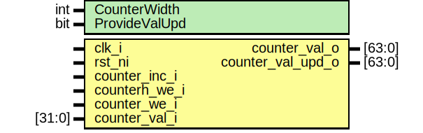

# Entity: ibex_counter

- **File**: ibex_counter.sv

## Diagram

## Generics

| Generic name  | Type | Value | Description |
| ------------- | ---- | ----- | ----------- |
| CounterWidth  | int  | 32    |             |
| ProvideValUpd | bit  | 0     |             |

## Ports

| Port name         | Direction | Type   | Description |
| ----------------- | --------- | ------ | ----------- |
| clk_i             | input     |        |             |
| rst_ni            | input     |        |             |
| counter_inc_i     | input     |        |             |
| counterh_we_i     | input     |        |             |
| counter_we_i      | input     |        |             |
| counter_val_i     | input     | [31:0] |             |
| counter_val_o     | output    | [63:0] |             |
| counter_val_upd_o | output    | [63:0] |             |

## Signals

| Name         | Type                     | Description |
| ------------ | ------------------------ | ----------- |
| counter      | logic [63:0]             |             |
| counter_upd  | logic [CounterWidth-1:0] |             |
| counter_load | logic [63:0]             |             |
| we           | logic                    |             |
| counter_d    | logic [CounterWidth-1:0] |             |
| counter_q    | logic [CounterWidth-1:0] |             |
| counter_q    | logic [CounterWidth-1:0] |             |

## Constants

| Name      | Type | Value | Description |
| --------- | ---- | ----- | ----------- |
| DspPragma | int  | "yes" |             |

## Processes

- unnamed: ( )
  - **Type:** always_comb
- unnamed: ( @(`COUNTER_FLOP_RST) )
  - **Type:** always_ff
