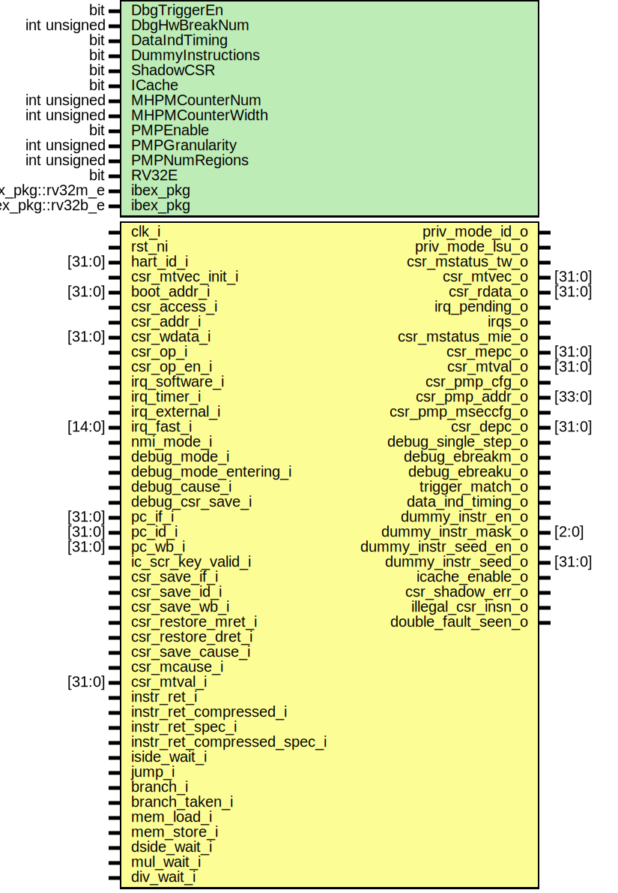

# Entity: ibex_cs_registers

- **File**: ibex_cs_registers.sv

## Diagram

## Generics

| Generic name      | Type              | Value               | Description |
| ----------------- | ----------------- | ------------------- | ----------- |
| DbgTriggerEn      | bit               | 0                   |             |
| DbgHwBreakNum     | int unsigned      | 1                   |             |
| DataIndTiming     | bit               | 1'b0                |             |
| DummyInstructions | bit               | 1'b0                |             |
| ShadowCSR         | bit               | 1'b0                |             |
| ICache            | bit               | 1'b0                |             |
| MHPMCounterNum    | int unsigned      | 10                  |             |
| MHPMCounterWidth  | int unsigned      | 40                  |             |
| PMPEnable         | bit               | 0                   |             |
| PMPGranularity    | int unsigned      | 0                   |             |
| PMPNumRegions     | int unsigned      | 4                   |             |
| RV32E             | bit               | 0                   |             |
| ibex_pkg          | ibex_pkg::rv32m_e | ibex_pkg::RV32MFast |             |
| ibex_pkg          | ibex_pkg::rv32b_e | ibex_pkg::RV32BNone |             |

## Ports

| Port name                   | Direction | Type   | Description |
| --------------------------- | --------- | ------ | ----------- |
| clk_i                       | input     |        |             |
| rst_ni                      | input     |        |             |
| hart_id_i                   | input     | [31:0] |             |
| priv_mode_id_o              | output    |        |             |
| priv_mode_lsu_o             | output    |        |             |
| csr_mstatus_tw_o            | output    |        |             |
| csr_mtvec_o                 | output    | [31:0] |             |
| csr_mtvec_init_i            | input     |        |             |
| boot_addr_i                 | input     | [31:0] |             |
| csr_access_i                | input     |        |             |
| csr_addr_i                  | input     |        |             |
| csr_wdata_i                 | input     | [31:0] |             |
| csr_op_i                    | input     |        |             |
| csr_op_en_i                 | input     |        |             |
| csr_rdata_o                 | output    | [31:0] |             |
| irq_software_i              | input     |        |             |
| irq_timer_i                 | input     |        |             |
| irq_external_i              | input     |        |             |
| irq_fast_i                  | input     | [14:0] |             |
| nmi_mode_i                  | input     |        |             |
| irq_pending_o               | output    |        |             |
| irqs_o                      | output    |        |             |
| csr_mstatus_mie_o           | output    |        |             |
| csr_mepc_o                  | output    | [31:0] |             |
| csr_mtval_o                 | output    | [31:0] |             |
| csr_pmp_cfg_o               | output    |        |             |
| csr_pmp_addr_o              | output    | [33:0] |             |
| csr_pmp_mseccfg_o           | output    |        |             |
| debug_mode_i                | input     |        |             |
| debug_mode_entering_i       | input     |        |             |
| debug_cause_i               | input     |        |             |
| debug_csr_save_i            | input     |        |             |
| csr_depc_o                  | output    | [31:0] |             |
| debug_single_step_o         | output    |        |             |
| debug_ebreakm_o             | output    |        |             |
| debug_ebreaku_o             | output    |        |             |
| trigger_match_o             | output    |        |             |
| pc_if_i                     | input     | [31:0] |             |
| pc_id_i                     | input     | [31:0] |             |
| pc_wb_i                     | input     | [31:0] |             |
| data_ind_timing_o           | output    |        |             |
| dummy_instr_en_o            | output    |        |             |
| dummy_instr_mask_o          | output    | [2:0]  |             |
| dummy_instr_seed_en_o       | output    |        |             |
| dummy_instr_seed_o          | output    | [31:0] |             |
| icache_enable_o             | output    |        |             |
| csr_shadow_err_o            | output    |        |             |
| ic_scr_key_valid_i          | input     |        |             |
| csr_save_if_i               | input     |        |             |
| csr_save_id_i               | input     |        |             |
| csr_save_wb_i               | input     |        |             |
| csr_restore_mret_i          | input     |        |             |
| csr_restore_dret_i          | input     |        |             |
| csr_save_cause_i            | input     |        |             |
| csr_mcause_i                | input     |        |             |
| csr_mtval_i                 | input     | [31:0] |             |
| illegal_csr_insn_o          | output    |        |             |
| double_fault_seen_o         | output    |        |             |
| instr_ret_i                 | input     |        |             |
| instr_ret_compressed_i      | input     |        |             |
| instr_ret_spec_i            | input     |        |             |
| instr_ret_compressed_spec_i | input     |        |             |
| iside_wait_i                | input     |        |             |
| jump_i                      | input     |        |             |
| branch_i                    | input     |        |             |
| branch_taken_i              | input     |        |             |
| mem_load_i                  | input     |        |             |
| mem_store_i                 | input     |        |             |
| dside_wait_i                | input     |        |             |
| mul_wait_i                  | input     |        |             |
| div_wait_i                  | input     |        |             |

## Signals

| Name                          | Type                         | Description |
| ----------------------------- | ---------------------------- | ----------- |
| exception_pc                  | logic [31:0]                 |             |
| priv_lvl_q                    | priv_lvl_e                   |             |
| priv_lvl_d                    | priv_lvl_e                   |             |
| mstatus_q                     | status_t                     |             |
| mstatus_d                     | status_t                     |             |
| mstatus_err                   | logic                        |             |
| mstatus_en                    | logic                        |             |
| mie_q                         | irqs_t                       |             |
| mie_d                         | irqs_t                       |             |
| mie_en                        | logic                        |             |
| mscratch_q                    | logic [31:0]                 |             |
| mscratch_en                   | logic                        |             |
| mepc_q                        | logic [31:0]                 |             |
| mepc_d                        | logic [31:0]                 |             |
| mepc_en                       | logic                        |             |
| mcause_q                      | exc_cause_t                  |             |
| mcause_d                      | exc_cause_t                  |             |
| mcause_en                     | logic                        |             |
| mtval_q                       | logic [31:0]                 |             |
| mtval_d                       | logic [31:0]                 |             |
| mtval_en                      | logic                        |             |
| mtvec_q                       | logic [31:0]                 |             |
| mtvec_d                       | logic [31:0]                 |             |
| mtvec_err                     | logic                        |             |
| mtvec_en                      | logic                        |             |
| mip                           | irqs_t                       |             |
| dcsr_q                        | dcsr_t                       |             |
| dcsr_d                        | dcsr_t                       |             |
| dcsr_en                       | logic                        |             |
| depc_q                        | logic [31:0]                 |             |
| depc_d                        | logic [31:0]                 |             |
| depc_en                       | logic                        |             |
| dscratch0_q                   | logic [31:0]                 |             |
| dscratch1_q                   | logic [31:0]                 |             |
| dscratch0_en                  | logic                        |             |
| dscratch1_en                  | logic                        |             |
| mstack_q                      | status_stk_t                 |             |
| mstack_d                      | status_stk_t                 |             |
| mstack_en                     | logic                        |             |
| mstack_epc_q                  | logic [31:0]                 |             |
| mstack_epc_d                  | logic [31:0]                 |             |
| mstack_cause_q                | exc_cause_t                  |             |
| mstack_cause_d                | exc_cause_t                  |             |
| pmp_addr_rdata                | logic [31:0]                 |             |
| pmp_cfg_rdata                 | logic [PMP_CFG_W-1:0]        |             |
| pmp_csr_err                   | logic                        |             |
| pmp_mseccfg                   | pmp_mseccfg_t                |             |
| mcountinhibit                 | logic [31:0]                 |             |
| mcountinhibit_d               | logic [MHPMCounterNum+3-1:0] |             |
| mcountinhibit_q               | logic [MHPMCounterNum+3-1:0] |             |
| mcountinhibit_we              | logic                        |             |
| mhpmcounter                   | logic [63:0]                 |             |
| mhpmcounter_we                | logic [31:0]                 |             |
| mhpmcounterh_we               | logic [31:0]                 |             |
| mhpmcounter_incr              | logic [31:0]                 |             |
| mhpmevent                     | logic [31:0]                 |             |
| mhpmcounter_idx               | logic [4:0]                  |             |
| unused_mhpmcounter_we_1       | logic                        |             |
| unused_mhpmcounterh_we_1      | logic                        |             |
| unused_mhpmcounter_incr_1     | logic                        |             |
| minstret_next                 | logic [63:0]                 |             |
| minstret_raw                  | logic [63:0]                 |             |
| tselect_rdata                 | logic [31:0]                 |             |
| tmatch_control_rdata          | logic [31:0]                 |             |
| tmatch_value_rdata            | logic [31:0]                 |             |
| cpuctrlsts_part_q             | cpu_ctrl_sts_part_t          |             |
| cpuctrlsts_part_d             | cpu_ctrl_sts_part_t          |             |
| cpuctrlsts_part_wdata_raw     | cpu_ctrl_sts_part_t          |             |
| cpuctrlsts_part_wdata         | cpu_ctrl_sts_part_t          |             |
| cpuctrlsts_part_we            | logic                        |             |
| cpuctrlsts_part_err           | logic                        |             |
| cpuctrlsts_ic_scr_key_valid_q | logic                        |             |
| cpuctrlsts_ic_scr_key_err     | logic                        |             |
| csr_wdata_int                 | logic [31:0]                 |             |
| csr_rdata_int                 | logic [31:0]                 |             |
| csr_we_int                    | logic                        |             |
| csr_wr                        | logic                        |             |
| dbg_csr                       | logic                        |             |
| illegal_csr                   | logic                        |             |
| illegal_csr_priv              | logic                        |             |
| illegal_csr_dbg               | logic                        |             |
| illegal_csr_write             | logic                        |             |
| unused_boot_addr              | logic [7:0]                  |             |
| unused_csr_addr               | logic [2:0]                  |             |
| csr_addr                      | logic [$bits(csr_num_e)-1:0] |             |
| pmp_mseccfg_q                 | pmp_mseccfg_t                |             |
| pmp_mseccfg_d                 | pmp_mseccfg_t                |             |
| pmp_mseccfg_we                | logic                        |             |
| pmp_mseccfg_err               | logic                        |             |
| pmp_cfg                       | pmp_cfg_t                    |             |
| pmp_cfg_locked                | logic [PMPNumRegions-1:0]    |             |
| pmp_cfg_wr_suppress           | logic [PMPNumRegions-1:0]    |             |
| pmp_cfg_wdata                 | pmp_cfg_t                    |             |
| pmp_addr                      | logic [PMPAddrWidth-1:0]     |             |
| pmp_cfg_we                    | logic [PMPNumRegions-1:0]    |             |
| pmp_cfg_err                   | logic [PMPNumRegions-1:0]    |             |
| pmp_addr_we                   | logic [PMPNumRegions-1:0]    |             |
| pmp_addr_err                  | logic [PMPNumRegions-1:0]    |             |
| any_pmp_entry_locked          | logic                        |             |
| g_no_pmp_tieoffs              | end                          |             |
| assign                        | end                          |             |

## Constants

| Name             | Type         | Value               | Description |
| ---------------- | ------------ | ------------------- | ----------- |
| RV32BExtra       | int unsigned | undefined           |             |
| RV32MEnabled     | int unsigned | undefined           |             |
| PMPAddrWidth     | int unsigned | 33 - PMPGranularity |             |
| MISA_VALUE       | logic [31:0] | (0                  |             |
| MSTATUS_RST_VAL  | status_t     |                     |             |
| ShadowCSR        | status_t     | undefined           |             |
| clk_i            | status_t     | undefined           |             |
| rst_ni           | status_t     | undefined           |             |
| mstatus_d        | status_t     | undefined           |             |
| mstatus_en       | status_t     | undefined           |             |
| mstatus_q        | status_t     | undefined           |             |
| mstatus_err      | status_t     | undefined           |             |
| DCSR_RESET_VAL   | dcsr_t       |                     |             |
| ShadowCopy       | dcsr_t       | undefined           |             |
| clk_i            | dcsr_t       | undefined           |             |
| rst_ni           | dcsr_t       | undefined           |             |
| dcsr_d           | dcsr_t       | undefined           |             |
| dcsr_en          | dcsr_t       | undefined           |             |
| dcsr_q           | dcsr_t       | undefined           |             |
| rd_error_o       | dcsr_t       | undefined           |             |
| MSTACK_RESET_VAL | status_stk_t | ibex_csr #(         |             |
| ShadowCopy       | status_stk_t | undefined           |             |
| clk_i            | status_stk_t | undefined           |             |
| rst_ni           | status_stk_t | undefined           |             |
| mstack_d         | status_stk_t | undefined           |             |
| mstack_en        | status_stk_t | undefined           |             |
| mstack_q         | status_stk_t | undefined           |             |
| rd_error_o       | status_stk_t | undefined           |             |

## Types

| Name                | Type                                                                                                                                                                                                                                                                                                                                                                                                                                                                                                                                                                                                                                                                                                                                                                                                                                                          | Description |
| ------------------- | ------------------------------------------------------------------------------------------------------------------------------------------------------------------------------------------------------------------------------------------------------------------------------------------------------------------------------------------------------------------------------------------------------------------------------------------------------------------------------------------------------------------------------------------------------------------------------------------------------------------------------------------------------------------------------------------------------------------------------------------------------------------------------------------------------------------------------------------------------------- | ----------- |
| status_stk_t        | struct packed {  logic mpie;  priv_lvl_e mpp;  }                                                                                                                                                                                                                                                                                                                                                                                                                                                                                                                                                                                                                                                                                                     |             |
| dcsr_t              | struct packed {  x_debug_ver_e xdebugver;  logic [11:0] zero2;  logic ebreakm;  logic zero1;  logic ebreaks;  logic ebreaku;  logic stepie;  logic stopcount;  logic stoptime;  dbg_cause_e cause;  logic zero0;  logic mprven;  logic nmip;  logic step;  priv_lvl_e prv;  } |             |
| cpu_ctrl_sts_part_t | struct packed {  logic double_fault_seen;  logic sync_exc_seen;  logic [2:0] dummy_instr_mask;  logic dummy_instr_en;  logic data_ind_timing;  logic icache_enable;  }                                                                                                                                                                                                                                                                                                                                                                                                                                   |             |

## Functions

- is_mml_m_exec_cfg (ibex_pkg::pmp_cfg_t pmp_cfg) return (logic)

## Processes

- unnamed: ( )
  - **Type:** always_comb
- unnamed: ( )
  - **Type:** always_comb
- unnamed: ( @(posedge clk_i or negedge rst_ni) )
  - **Type:** always_ff
- unnamed: ( )
  - **Type:** always_comb
- mcountinhibit_update: ( )
  - **Type:** always_comb
- gen_mhpmcounter_incr: ( )
  - **Type:** always_comb
- gen_mhpmevent: ( )
  - **Type:** always_comb
- unnamed: ( @(posedge clk_i or negedge rst_ni) )
  - **Type:** always_ff

## Instantiations

- u_mepc_csr: ibex_csr
- u_mscratch_csr: ibex_csr
- u_mtval_csr: ibex_csr
- u_mtvec_csr: ibex_csr
- u_depc_csr: ibex_csr
- u_dscratch0_csr: ibex_csr
- u_dscratch1_csr: ibex_csr
- u_mstack_epc_csr: ibex_csr
- mcycle_counter_i: ibex_counter
- minstret_counter_i: ibex_counter
