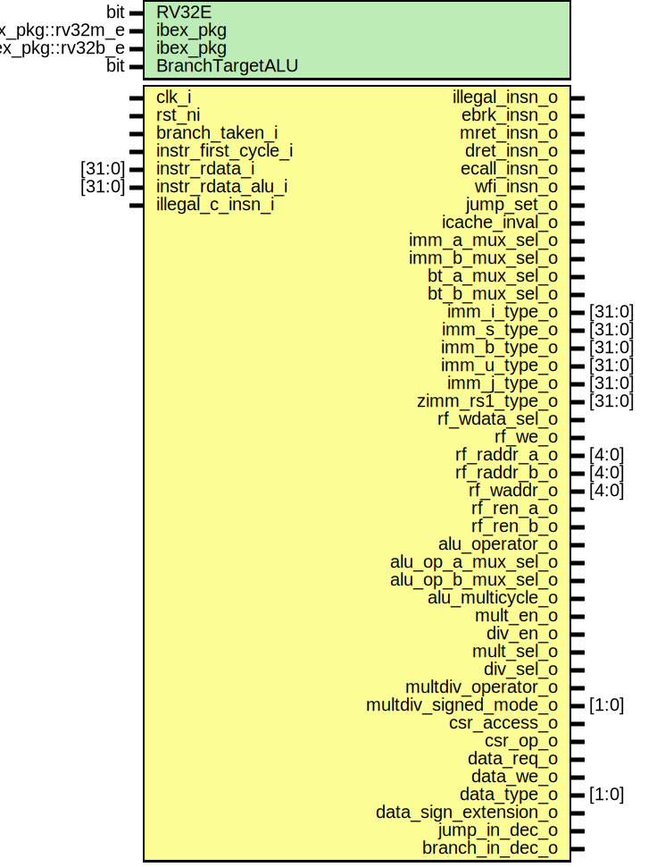

# Entity: ibex_decoder

- **File**: ibex_decoder.sv

## Diagram

## Generics

| Generic name    | Type              | Value               | Description |
| --------------- | ----------------- | ------------------- | ----------- |
| RV32E           | bit               | 0                   |             |
| ibex_pkg        | ibex_pkg::rv32m_e | ibex_pkg::RV32MFast |             |
| ibex_pkg        | ibex_pkg::rv32b_e | ibex_pkg::RV32BNone |             |
| BranchTargetALU | bit               | 0                   |             |

## Ports

| Port name             | Direction | Type   | Description |
| --------------------- | --------- | ------ | ----------- |
| clk_i                 | input     |        |             |
| rst_ni                | input     |        |             |
| illegal_insn_o        | output    |        |             |
| ebrk_insn_o           | output    |        |             |
| mret_insn_o           | output    |        |             |
| dret_insn_o           | output    |        |             |
| ecall_insn_o          | output    |        |             |
| wfi_insn_o            | output    |        |             |
| jump_set_o            | output    |        |             |
| branch_taken_i        | input     |        |             |
| icache_inval_o        | output    |        |             |
| instr_first_cycle_i   | input     |        |             |
| instr_rdata_i         | input     | [31:0] |             |
| instr_rdata_alu_i     | input     | [31:0] |             |
| illegal_c_insn_i      | input     |        |             |
| imm_a_mux_sel_o       | output    |        |             |
| imm_b_mux_sel_o       | output    |        |             |
| bt_a_mux_sel_o        | output    |        |             |
| bt_b_mux_sel_o        | output    |        |             |
| imm_i_type_o          | output    | [31:0] |             |
| imm_s_type_o          | output    | [31:0] |             |
| imm_b_type_o          | output    | [31:0] |             |
| imm_u_type_o          | output    | [31:0] |             |
| imm_j_type_o          | output    | [31:0] |             |
| zimm_rs1_type_o       | output    | [31:0] |             |
| rf_wdata_sel_o        | output    |        |             |
| rf_we_o               | output    |        |             |
| rf_raddr_a_o          | output    | [4:0]  |             |
| rf_raddr_b_o          | output    | [4:0]  |             |
| rf_waddr_o            | output    | [4:0]  |             |
| rf_ren_a_o            | output    |        |             |
| rf_ren_b_o            | output    |        |             |
| alu_operator_o        | output    |        |             |
| alu_op_a_mux_sel_o    | output    |        |             |
| alu_op_b_mux_sel_o    | output    |        |             |
| alu_multicycle_o      | output    |        |             |
| mult_en_o             | output    |        |             |
| div_en_o              | output    |        |             |
| mult_sel_o            | output    |        |             |
| div_sel_o             | output    |        |             |
| multdiv_operator_o    | output    |        |             |
| multdiv_signed_mode_o | output    | [1:0]  |             |
| csr_access_o          | output    |        |             |
| csr_op_o              | output    |        |             |
| data_req_o            | output    |        |             |
| data_we_o             | output    |        |             |
| data_type_o           | output    | [1:0]  |             |
| data_sign_extension_o | output    |        |             |
| jump_in_dec_o         | output    |        |             |
| branch_in_dec_o       | output    |        |             |

## Signals

| Name              | Type         | Description |
| ----------------- | ------------ | ----------- |
| illegal_insn      | logic        |             |
| illegal_reg_rv32e | logic        |             |
| csr_illegal       | logic        |             |
| rf_we             | logic        |             |
| instr             | logic [31:0] |             |
| instr_alu         | logic [31:0] |             |
| unused_instr_alu  | logic [9:0]  |             |
| instr_rs1         | logic [4:0]  |             |
| instr_rs2         | logic [4:0]  |             |
| instr_rs3         | logic [4:0]  |             |
| instr_rd          | logic [4:0]  |             |
| use_rs3_d         | logic        |             |
| use_rs3_q         | logic        |             |
| csr_op            | csr_op_e     |             |
| opcode            | opcode_e     |             |
| opcode_alu        | opcode_e     |             |

## Processes

- csr_operand_check: ( )
  - **Type:** always_comb
- unnamed: ( )
  - **Type:** always_comb
- unnamed: ( )
  - **Type:** always_comb
