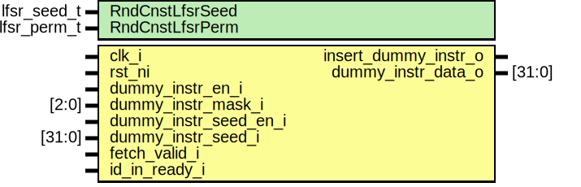

# Entity: ibex_dummy_instr

- **File**: ibex_dummy_instr.sv

## Diagram

## Generics

| Generic name    | Type        | Value                  | Description |
| --------------- | ----------- | ---------------------- | ----------- |
| RndCnstLfsrSeed | lfsr_seed_t | RndCnstLfsrSeedDefault |             |
| RndCnstLfsrPerm | lfsr_perm_t | RndCnstLfsrPermDefault |             |

## Ports

| Port name             | Direction | Type   | Description |
| --------------------- | --------- | ------ | ----------- |
| clk_i                 | input     |        |             |
| rst_ni                | input     |        |             |
| dummy_instr_en_i      | input     |        |             |
| dummy_instr_mask_i    | input     | [2:0]  |             |
| dummy_instr_seed_en_i | input     |        |             |
| dummy_instr_seed_i    | input     | [31:0] |             |
| fetch_valid_i         | input     |        |             |
| id_in_ready_i         | input     |        |             |
| insert_dummy_instr_o  | output    |        |             |
| dummy_instr_data_o    | output    | [31:0] |             |

## Signals

| Name                | Type                      | Description |
| ------------------- | ------------------------- | ----------- |
| lfsr_data           | lfsr_data_t               |             |
| dummy_cnt_incr      | logic [TIMEOUT_CNT_W-1:0] |             |
| dummy_cnt_threshold | logic [TIMEOUT_CNT_W-1:0] |             |
| dummy_cnt_d         | logic [TIMEOUT_CNT_W-1:0] |             |
| dummy_cnt_q         | logic [TIMEOUT_CNT_W-1:0] |             |
| dummy_cnt_en        | logic                     |             |
| lfsr_en             | logic                     |             |
| lfsr_state          | logic [LFSR_OUT_W-1:0]    |             |
| insert_dummy_instr  | logic                     |             |
| dummy_set           | logic [6:0]               |             |
| dummy_opcode        | logic [2:0]               |             |
| dummy_instr         | logic [31:0]              |             |
| dummy_instr_seed_q  | logic [31:0]              |             |
| dummy_instr_seed_d  | logic [31:0]              |             |

## Constants

| Name          | Type         | Value              | Description |
| ------------- | ------------ | ------------------ | ----------- |
| TIMEOUT_CNT_W | int unsigned | 5                  |             |
| OP_W          | int unsigned | 5                  |             |
| LFSR_OUT_W    | int unsigned | $bits(lfsr_data_t) |             |

## Types

| Name          | Type                                                                                                                                                                                                                                                                                                         | Description |
| ------------- | ------------------------------------------------------------------------------------------------------------------------------------------------------------------------------------------------------------------------------------------------------------------------------------------------------------ | ----------- |
| dummy_instr_e | enum logic [1:0] {  DUMMY_ADD = 2'b00,  DUMMY_MUL = 2'b01,  DUMMY_DIV = 2'b10,  DUMMY_AND = 2'b11 }                                                              |             |
| lfsr_data_t   | struct packed {  dummy_instr_e instr_type;  logic [OP_W-1:0] op_b;  logic [OP_W-1:0] op_a;  logic [TIMEOUT_CNT_W-1:0] cnt;  } |             |

## Processes

- unnamed: ( @(posedge clk_i or negedge rst_ni) )
  - **Type:** always_ff
- unnamed: ( @(posedge clk_i or negedge rst_ni) )
  - **Type:** always_ff
- unnamed: ( )
  - **Type:** always_comb

## Instantiations

- lfsr_i: prim_lfsr
