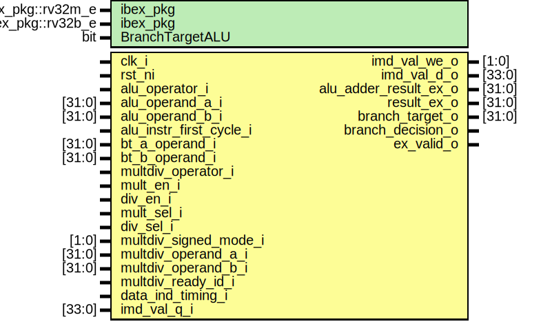

# Entity: ibex_ex_block

- **File**: ibex_ex_block.sv

## Diagram

## Generics

| Generic name    | Type              | Value               | Description |
| --------------- | ----------------- | ------------------- | ----------- |
| ibex_pkg        | ibex_pkg::rv32m_e | ibex_pkg::RV32MFast |             |
| ibex_pkg        | ibex_pkg::rv32b_e | ibex_pkg::RV32BNone |             |
| BranchTargetALU | bit               | 0                   |             |

## Ports

| Port name               | Direction | Type   | Description |
| ----------------------- | --------- | ------ | ----------- |
| clk_i                   | input     |        |             |
| rst_ni                  | input     |        |             |
| alu_operator_i          | input     |        |             |
| alu_operand_a_i         | input     | [31:0] |             |
| alu_operand_b_i         | input     | [31:0] |             |
| alu_instr_first_cycle_i | input     |        |             |
| bt_a_operand_i          | input     | [31:0] |             |
| bt_b_operand_i          | input     | [31:0] |             |
| multdiv_operator_i      | input     |        |             |
| mult_en_i               | input     |        |             |
| div_en_i                | input     |        |             |
| mult_sel_i              | input     |        |             |
| div_sel_i               | input     |        |             |
| multdiv_signed_mode_i   | input     | [1:0]  |             |
| multdiv_operand_a_i     | input     | [31:0] |             |
| multdiv_operand_b_i     | input     | [31:0] |             |
| multdiv_ready_id_i      | input     |        |             |
| data_ind_timing_i       | input     |        |             |
| imd_val_we_o            | output    | [1:0]  |             |
| imd_val_d_o             | output    | [33:0] |             |
| imd_val_q_i             | input     | [33:0] |             |
| alu_adder_result_ex_o   | output    | [31:0] |             |
| result_ex_o             | output    | [31:0] |             |
| branch_target_o         | output    | [31:0] |             |
| branch_decision_o       | output    |        |             |
| ex_valid_o              | output    |        |             |

## Signals

| Name                  | Type         | Description |
| --------------------- | ------------ | ----------- |
| alu_result            | logic [31:0] |             |
| multdiv_result        | logic [31:0] |             |
| multdiv_alu_operand_b | logic [32:0] |             |
| multdiv_alu_operand_a | logic [32:0] |             |
| alu_adder_result_ext  | logic [33:0] |             |
| alu_cmp_result        | logic        |             |
| alu_is_equal_result   | logic        |             |
| multdiv_valid         | logic        |             |
| multdiv_sel           | logic        |             |
| alu_imd_val_q         | logic [31:0] |             |
| alu_imd_val_d         | logic [31:0] |             |
| alu_imd_val_we        | logic [ 1:0] |             |
| multdiv_imd_val_d     | logic [33:0] |             |
| multdiv_imd_val_we    | logic [ 1:0] |             |

## Instantiations

- alu_i: ibex_alu
