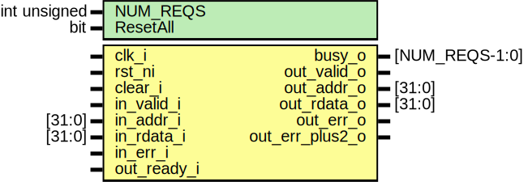

# Entity: ibex_fetch_fifo

- **File**: ibex_fetch_fifo.sv

## Diagram

## Generics

| Generic name | Type         | Value | Description |
| ------------ | ------------ | ----- | ----------- |
| NUM_REQS     | int unsigned | 2     |             |
| ResetAll     | bit          | 1'b0  |             |

## Ports

| Port name       | Direction | Type           | Description |
| --------------- | --------- | -------------- | ----------- |
| clk_i           | input     |                |             |
| rst_ni          | input     |                |             |
| clear_i         | input     |                |             |
| busy_o          | output    | [NUM_REQS-1:0] |             |
| in_valid_i      | input     |                |             |
| in_addr_i       | input     | [31:0]         |             |
| in_rdata_i      | input     | [31:0]         |             |
| in_err_i        | input     |                |             |
| out_valid_o     | output    |                |             |
| out_ready_i     | input     |                |             |
| out_addr_o      | output    | [31:0]         |             |
| out_rdata_o     | output    | [31:0]         |             |
| out_err_o       | output    |                |             |
| out_err_plus2_o | output    |                |             |

## Signals

| Name                    | Type                     | Description |
| ----------------------- | ------------------------ | ----------- |
| rdata_d                 | logic [DEPTH-1:0] [31:0] |             |
| rdata_q                 | logic [DEPTH-1:0] [31:0] |             |
| err_d                   | logic [DEPTH-1:0]        |             |
| err_q                   | logic [DEPTH-1:0]        |             |
| valid_d                 | logic [DEPTH-1:0]        |             |
| valid_q                 | logic [DEPTH-1:0]        |             |
| lowest_free_entry       | logic [DEPTH-1:0]        |             |
| valid_pushed            | logic [DEPTH-1:0]        |             |
| valid_popped            | logic [DEPTH-1:0]        |             |
| entry_en                | logic [DEPTH-1:0]        |             |
| pop_fifo                | logic                    |             |
| rdata                   | logic [31:0]             |             |
| rdata_unaligned         | logic [31:0]             |             |
| err                     | logic                    |             |
| err_unaligned           | logic                    |             |
| err_plus2               | logic                    |             |
| valid                   | logic                    |             |
| valid_unaligned         | logic                    |             |
| aligned_is_compressed   | logic                    |             |
| unaligned_is_compressed | logic                    |             |
| addr_incr_two           | logic                    |             |
| instr_addr_next         | logic [31:1]             |             |
| instr_addr_d            | logic [31:1]             |             |
| instr_addr_q            | logic [31:1]             |             |
| instr_addr_en           | logic                    |             |
| unused_addr_in          | logic                    |             |

## Constants

| Name  | Type         | Value      | Description |
| ----- | ------------ | ---------- | ----------- |
| DEPTH | int unsigned | NUM_REQS+1 |             |

## Processes

- unnamed: ( )
  - **Type:** always_comb
- unnamed: ( @(posedge clk_i or negedge rst_ni) )
  - **Type:** always_ff
