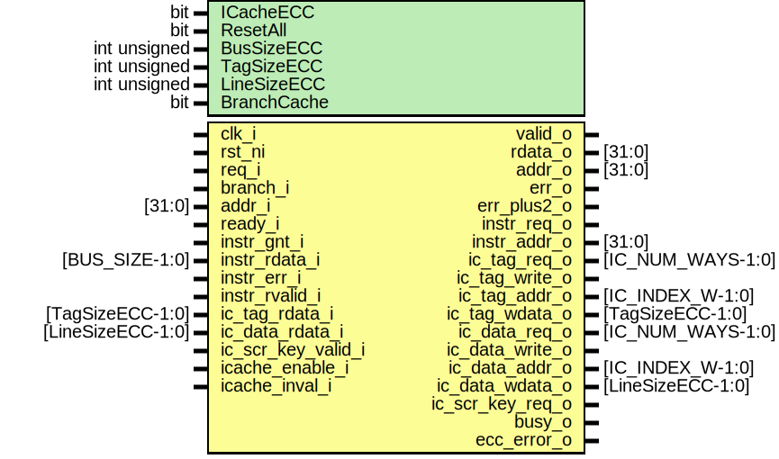
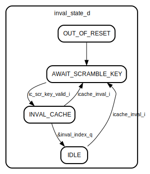

# Entity: ibex_icache

- **File**: ibex_icache.sv

## Diagram

## Generics

| Generic name | Type         | Value        | Description |
| ------------ | ------------ | ------------ | ----------- |
| ICacheECC    | bit          | 1'b0         |             |
| ResetAll     | bit          | 1'b0         |             |
| BusSizeECC   | int unsigned | BUS_SIZE     |             |
| TagSizeECC   | int unsigned | IC_TAG_SIZE  |             |
| LineSizeECC  | int unsigned | IC_LINE_SIZE |             |
| BranchCache  | bit          | 1'b0         |             |

## Ports

| Port name          | Direction | Type              | Description |
| ------------------ | --------- | ----------------- | ----------- |
| clk_i              | input     |                   |             |
| rst_ni             | input     |                   |             |
| req_i              | input     |                   |             |
| branch_i           | input     |                   |             |
| addr_i             | input     | [31:0]            |             |
| ready_i            | input     |                   |             |
| valid_o            | output    |                   |             |
| rdata_o            | output    | [31:0]            |             |
| addr_o             | output    | [31:0]            |             |
| err_o              | output    |                   |             |
| err_plus2_o        | output    |                   |             |
| instr_req_o        | output    |                   |             |
| instr_gnt_i        | input     |                   |             |
| instr_addr_o       | output    | [31:0]            |             |
| instr_rdata_i      | input     | [BUS_SIZE-1:0]    |             |
| instr_err_i        | input     |                   |             |
| instr_rvalid_i     | input     |                   |             |
| ic_tag_req_o       | output    | [IC_NUM_WAYS-1:0] |             |
| ic_tag_write_o     | output    |                   |             |
| ic_tag_addr_o      | output    | [IC_INDEX_W-1:0]  |             |
| ic_tag_wdata_o     | output    | [TagSizeECC-1:0]  |             |
| ic_tag_rdata_i     | input     | [TagSizeECC-1:0]  |             |
| ic_data_req_o      | output    | [IC_NUM_WAYS-1:0] |             |
| ic_data_write_o    | output    |                   |             |
| ic_data_addr_o     | output    | [IC_INDEX_W-1:0]  |             |
| ic_data_wdata_o    | output    | [LineSizeECC-1:0] |             |
| ic_data_rdata_i    | input     | [LineSizeECC-1:0] |             |
| ic_scr_key_valid_i | input     |                   |             |
| ic_scr_key_req_o   | output    |                   |             |
| icache_enable_i    | input     |                   |             |
| icache_inval_i     | input     |                   |             |
| busy_o             | output    |                   |             |
| ecc_error_o        | output    |                   |             |

## Signals

| Name                   | Type                                    | Description |
| ---------------------- | --------------------------------------- | ----------- |
| lookup_addr_aligned    | logic [ADDR_W-1:0]                      |             |
| prefetch_addr_d        | logic [ADDR_W-1:0]                      |             |
| prefetch_addr_q        | logic [ADDR_W-1:0]                      |             |
| prefetch_addr_en       | logic                                   |             |
| lookup_throttle        | logic                                   |             |
| lookup_req_ic0         | logic                                   |             |
| lookup_addr_ic0        | logic [ADDR_W-1:0]                      |             |
| lookup_index_ic0       | logic [IC_INDEX_W-1:0]                  |             |
| fill_req_ic0           | logic                                   |             |
| fill_index_ic0         | logic [IC_INDEX_W-1:0]                  |             |
| fill_tag_ic0           | logic [IC_TAG_SIZE-1:0]                 |             |
| fill_wdata_ic0         | logic [IC_LINE_SIZE-1:0]                |             |
| lookup_grant_ic0       | logic                                   |             |
| lookup_actual_ic0      | logic                                   |             |
| fill_grant_ic0         | logic                                   |             |
| tag_req_ic0            | logic                                   |             |
| tag_index_ic0          | logic [IC_INDEX_W-1:0]                  |             |
| tag_banks_ic0          | logic [IC_NUM_WAYS-1:0]                 |             |
| tag_write_ic0          | logic                                   |             |
| tag_wdata_ic0          | logic [TagSizeECC-1:0]                  |             |
| data_req_ic0           | logic                                   |             |
| data_index_ic0         | logic [IC_INDEX_W-1:0]                  |             |
| data_banks_ic0         | logic [IC_NUM_WAYS-1:0]                 |             |
| data_write_ic0         | logic                                   |             |
| data_wdata_ic0         | logic [LineSizeECC-1:0]                 |             |
| tag_rdata_ic1          | logic [TagSizeECC-1:0]                  |             |
| data_rdata_ic1         | logic [LineSizeECC-1:0]                 |             |
| hit_data_ecc_ic1       | logic [LineSizeECC-1:0]                 |             |
| hit_data_ic1           | logic [IC_LINE_SIZE-1:0]                |             |
| lookup_valid_ic1       | logic                                   |             |
| lookup_addr_ic1        | logic [ADDR_W-1:IC_INDEX_HI+1]          |             |
| tag_match_ic1          | logic [IC_NUM_WAYS-1:0]                 |             |
| tag_hit_ic1            | logic                                   |             |
| tag_invalid_ic1        | logic [IC_NUM_WAYS-1:0]                 |             |
| lowest_invalid_way_ic1 | logic [IC_NUM_WAYS-1:0]                 |             |
| round_robin_way_ic1    | logic [IC_NUM_WAYS-1:0]                 |             |
| round_robin_way_q      | logic [IC_NUM_WAYS-1:0]                 |             |
| sel_way_ic1            | logic [IC_NUM_WAYS-1:0]                 |             |
| ecc_err_ic1            | logic                                   |             |
| ecc_write_req          | logic                                   |             |
| ecc_write_ways         | logic [IC_NUM_WAYS-1:0]                 |             |
| ecc_write_index        | logic [IC_INDEX_W-1:0]                  |             |
| fb_fill_level          | logic [$clog2(NUM_FB)-1:0]              |             |
| fill_cache_new         | logic                                   |             |
| fill_new_alloc         | logic                                   |             |
| fill_spec_req          | logic                                   |             |
| fill_spec_done         | logic                                   |             |
| fill_spec_hold         | logic                                   |             |
| fill_older_d           | logic [NUM_FB-1:0][NUM_FB-1:0]          |             |
| fill_older_q           | logic [NUM_FB-1:0][NUM_FB-1:0]          |             |
| fill_alloc_sel         | logic [NUM_FB-1:0]                      |             |
| fill_alloc             | logic [NUM_FB-1:0]                      |             |
| fill_busy_d            | logic [NUM_FB-1:0]                      |             |
| fill_busy_q            | logic [NUM_FB-1:0]                      |             |
| fill_done              | logic [NUM_FB-1:0]                      |             |
| fill_in_ic1            | logic [NUM_FB-1:0]                      |             |
| fill_stale_d           | logic [NUM_FB-1:0]                      |             |
| fill_stale_q           | logic [NUM_FB-1:0]                      |             |
| fill_cache_d           | logic [NUM_FB-1:0]                      |             |
| fill_cache_q           | logic [NUM_FB-1:0]                      |             |
| fill_hit_ic1           | logic [NUM_FB-1:0]                      |             |
| fill_hit_d             | logic [NUM_FB-1:0]                      |             |
| fill_hit_q             | logic [NUM_FB-1:0]                      |             |
| fill_ext_cnt_d         | logic [NUM_FB-1:0][IC_LINE_BEATS_W:0]   |             |
| fill_ext_cnt_q         | logic [NUM_FB-1:0][IC_LINE_BEATS_W:0]   |             |
| fill_ext_hold_d        | logic [NUM_FB-1:0]                      |             |
| fill_ext_hold_q        | logic [NUM_FB-1:0]                      |             |
| fill_ext_done_d        | logic [NUM_FB-1:0]                      |             |
| fill_ext_done_q        | logic [NUM_FB-1:0]                      |             |
| fill_rvd_cnt_d         | logic [NUM_FB-1:0][IC_LINE_BEATS_W:0]   |             |
| fill_rvd_cnt_q         | logic [NUM_FB-1:0][IC_LINE_BEATS_W:0]   |             |
| fill_rvd_done          | logic [NUM_FB-1:0]                      |             |
| fill_ram_done_d        | logic [NUM_FB-1:0]                      |             |
| fill_ram_done_q        | logic [NUM_FB-1:0]                      |             |
| fill_out_grant         | logic [NUM_FB-1:0]                      |             |
| fill_out_cnt_d         | logic [NUM_FB-1:0][IC_LINE_BEATS_W:0]   |             |
| fill_out_cnt_q         | logic [NUM_FB-1:0][IC_LINE_BEATS_W:0]   |             |
| fill_out_done          | logic [NUM_FB-1:0]                      |             |
| fill_ext_req           | logic [NUM_FB-1:0]                      |             |
| fill_rvd_exp           | logic [NUM_FB-1:0]                      |             |
| fill_ram_req           | logic [NUM_FB-1:0]                      |             |
| fill_out_req           | logic [NUM_FB-1:0]                      |             |
| fill_data_sel          | logic [NUM_FB-1:0]                      |             |
| fill_data_reg          | logic [NUM_FB-1:0]                      |             |
| fill_data_hit          | logic [NUM_FB-1:0]                      |             |
| fill_data_rvd          | logic [NUM_FB-1:0]                      |             |
| fill_ext_off           | logic [NUM_FB-1:0][IC_LINE_BEATS_W-1:0] |             |
| fill_rvd_off           | logic [NUM_FB-1:0][IC_LINE_BEATS_W-1:0] |             |
| fill_ext_beat          | logic [NUM_FB-1:0][IC_LINE_BEATS_W:0]   |             |
| fill_rvd_beat          | logic [NUM_FB-1:0][IC_LINE_BEATS_W:0]   |             |
| fill_ext_arb           | logic [NUM_FB-1:0]                      |             |
| fill_ram_arb           | logic [NUM_FB-1:0]                      |             |
| fill_out_arb           | logic [NUM_FB-1:0]                      |             |
| fill_rvd_arb           | logic [NUM_FB-1:0]                      |             |
| fill_entry_en          | logic [NUM_FB-1:0]                      |             |
| fill_addr_en           | logic [NUM_FB-1:0]                      |             |
| fill_way_en            | logic [NUM_FB-1:0]                      |             |
| fill_data_en           | logic [NUM_FB-1:0][IC_LINE_BEATS-1:0]   |             |
| fill_err_d             | logic [NUM_FB-1:0][IC_LINE_BEATS-1:0]   |             |
| fill_err_q             | logic [NUM_FB-1:0][IC_LINE_BEATS-1:0]   |             |
| fill_addr_q            | logic [ADDR_W-1:0]                      |             |
| fill_way_q             | logic [IC_NUM_WAYS-1:0]                 |             |
| fill_data_d            | logic [IC_LINE_SIZE-1:0]                |             |
| fill_data_q            | logic [IC_LINE_SIZE-1:0]                |             |
| fill_ext_req_addr      | logic [ADDR_W-1:BUS_W]                  |             |
| fill_ram_req_addr      | logic [ADDR_W-1:0]                      |             |
| fill_ram_req_way       | logic [IC_NUM_WAYS-1:0]                 |             |
| fill_ram_req_data      | logic [IC_LINE_SIZE-1:0]                |             |
| fill_out_data          | logic [IC_LINE_SIZE-1:0]                |             |
| fill_out_err           | logic [IC_LINE_BEATS-1:0]               |             |
| instr_req              | logic                                   |             |
| instr_addr             | logic [ADDR_W-1:BUS_W]                  |             |
| skid_complete_instr    | logic                                   |             |
| skid_ready             | logic                                   |             |
| output_compressed      | logic                                   |             |
| skid_valid_d           | logic                                   |             |
| skid_valid_q           | logic                                   |             |
| skid_en                | logic                                   |             |
| skid_data_d            | logic [15:0]                            |             |
| skid_data_q            | logic [15:0]                            |             |
| skid_err_q             | logic                                   |             |
| output_valid           | logic                                   |             |
| addr_incr_two          | logic                                   |             |
| output_addr_en         | logic                                   |             |
| output_addr_incr       | logic [ADDR_W-1:1]                      |             |
| output_addr_d          | logic [ADDR_W-1:1]                      |             |
| output_addr_q          | logic [ADDR_W-1:1]                      |             |
| output_data_lo         | logic [15:0]                            |             |
| output_data_hi         | logic [15:0]                            |             |
| data_valid             | logic                                   |             |
| output_ready           | logic                                   |             |
| line_data              | logic [IC_LINE_SIZE-1:0]                |             |
| line_err               | logic [IC_LINE_BEATS-1:0]               |             |
| line_data_muxed        | logic [31:0]                            |             |
| line_err_muxed         | logic                                   |             |
| output_data            | logic [31:0]                            |             |
| output_err             | logic                                   |             |
| inval_state_q          | inval_state_e                           |             |
| inval_state_d          | inval_state_e                           |             |
| inval_write_req        | logic                                   |             |
| inval_block_cache      | logic                                   |             |
| inval_index_d          | logic [IC_INDEX_W-1:0]                  |             |
| inval_index_q          | logic [IC_INDEX_W-1:0]                  |             |
| inval_index_en         | logic                                   |             |
| inval_active           | logic                                   |             |
| always_comb            | end                                     |             |
| fill_ram_req_addr      | begin                                   |             |
| assign                 | end                                     |             |
| packed_fill_addr_q     | logic [NUM_FB-1:0][ADDR_W-1:0]          |             |

## Constants

| Name         | Type         | Value      | Description |
| ------------ | ------------ | ---------- | ----------- |
| NUM_FB       | int unsigned | 4          |             |
| FB_THRESHOLD | int unsigned | NUM_FB - 2 |             |

## Types

| Name          | Type                                                                                                                                                                                                                     | Description |
| ------------- | ------------------------------------------------------------------------------------------------------------------------------------------------------------------------------------------------------------------------ | ----------- |
| inval_state_e | enum logic [1:0] {  OUT_OF_RESET,  AWAIT_SCRAMBLE_KEY,  INVAL_CACHE,  IDLE } |             |

## Processes

- unnamed: ( @(posedge clk_i or negedge rst_ni) )
  - **Type:** always_ff
- unnamed: ( )
  - **Type:** always_comb
- unnamed: ( @(posedge clk_i or negedge rst_ni) )
  - **Type:** always_ff
- unnamed: ( )
  - **Type:** always_comb
- unnamed: ( )
  - **Type:** always_comb
- unnamed: ( @(posedge clk_i or negedge rst_ni) )
  - **Type:** always_ff
- unnamed: ( )
  - **Type:** always_comb
- unnamed: ( )
  - **Type:** always_comb
- unnamed: ( )
  - **Type:** always_comb
- unnamed: ( @(posedge clk_i or negedge rst_ni) )
  - **Type:** always_ff
- unnamed: ( )
  - **Type:** always_comb

## State machines

