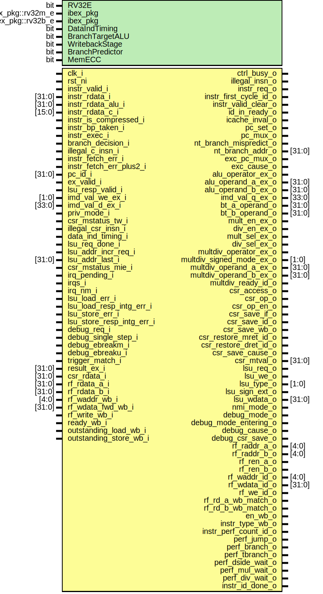
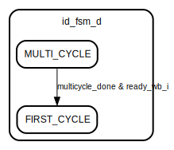

# Entity: ibex_id_stage

- **File**: ibex_id_stage.sv

## Diagram

## Generics

| Generic name    | Type              | Value               | Description |
| --------------- | ----------------- | ------------------- | ----------- |
| RV32E           | bit               | 0                   |             |
| ibex_pkg        | ibex_pkg::rv32m_e | ibex_pkg::RV32MFast |             |
| ibex_pkg        | ibex_pkg::rv32b_e | ibex_pkg::RV32BNone |             |
| DataIndTiming   | bit               | 1'b0                |             |
| BranchTargetALU | bit               | 0                   |             |
| WritebackStage  | bit               | 0                   |             |
| BranchPredictor | bit               | 0                   |             |
| MemECC          | bit               | 1'b0                |             |

## Ports

| Port name                 | Direction | Type   | Description |
| ------------------------- | --------- | ------ | ----------- |
| clk_i                     | input     |        |             |
| rst_ni                    | input     |        |             |
| ctrl_busy_o               | output    |        |             |
| illegal_insn_o            | output    |        |             |
| instr_valid_i             | input     |        |             |
| instr_rdata_i             | input     | [31:0] |             |
| instr_rdata_alu_i         | input     | [31:0] |             |
| instr_rdata_c_i           | input     | [15:0] |             |
| instr_is_compressed_i     | input     |        |             |
| instr_bp_taken_i          | input     |        |             |
| instr_req_o               | output    |        |             |
| instr_first_cycle_id_o    | output    |        |             |
| instr_valid_clear_o       | output    |        |             |
| id_in_ready_o             | output    |        |             |
| instr_exec_i              | input     |        |             |
| icache_inval_o            | output    |        |             |
| branch_decision_i         | input     |        |             |
| pc_set_o                  | output    |        |             |
| pc_mux_o                  | output    |        |             |
| nt_branch_mispredict_o    | output    |        |             |
| nt_branch_addr_o          | output    | [31:0] |             |
| exc_pc_mux_o              | output    |        |             |
| exc_cause_o               | output    |        |             |
| illegal_c_insn_i          | input     |        |             |
| instr_fetch_err_i         | input     |        |             |
| instr_fetch_err_plus2_i   | input     |        |             |
| pc_id_i                   | input     | [31:0] |             |
| ex_valid_i                | input     |        |             |
| lsu_resp_valid_i          | input     |        |             |
| alu_operator_ex_o         | output    |        |             |
| alu_operand_a_ex_o        | output    | [31:0] |             |
| alu_operand_b_ex_o        | output    | [31:0] |             |
| imd_val_we_ex_i           | input     | [1:0]  |             |
| imd_val_d_ex_i            | input     | [33:0] |             |
| imd_val_q_ex_o            | output    | [33:0] |             |
| bt_a_operand_o            | output    | [31:0] |             |
| bt_b_operand_o            | output    | [31:0] |             |
| mult_en_ex_o              | output    |        |             |
| div_en_ex_o               | output    |        |             |
| mult_sel_ex_o             | output    |        |             |
| div_sel_ex_o              | output    |        |             |
| multdiv_operator_ex_o     | output    |        |             |
| multdiv_signed_mode_ex_o  | output    | [1:0]  |             |
| multdiv_operand_a_ex_o    | output    | [31:0] |             |
| multdiv_operand_b_ex_o    | output    | [31:0] |             |
| multdiv_ready_id_o        | output    |        |             |
| csr_access_o              | output    |        |             |
| csr_op_o                  | output    |        |             |
| csr_op_en_o               | output    |        |             |
| csr_save_if_o             | output    |        |             |
| csr_save_id_o             | output    |        |             |
| csr_save_wb_o             | output    |        |             |
| csr_restore_mret_id_o     | output    |        |             |
| csr_restore_dret_id_o     | output    |        |             |
| csr_save_cause_o          | output    |        |             |
| csr_mtval_o               | output    | [31:0] |             |
| priv_mode_i               | input     |        |             |
| csr_mstatus_tw_i          | input     |        |             |
| illegal_csr_insn_i        | input     |        |             |
| data_ind_timing_i         | input     |        |             |
| lsu_req_o                 | output    |        |             |
| lsu_we_o                  | output    |        |             |
| lsu_type_o                | output    | [1:0]  |             |
| lsu_sign_ext_o            | output    |        |             |
| lsu_wdata_o               | output    | [31:0] |             |
| lsu_req_done_i            | input     |        |             |
| lsu_addr_incr_req_i       | input     |        |             |
| lsu_addr_last_i           | input     | [31:0] |             |
| csr_mstatus_mie_i         | input     |        |             |
| irq_pending_i             | input     |        |             |
| irqs_i                    | input     |        |             |
| irq_nm_i                  | input     |        |             |
| nmi_mode_o                | output    |        |             |
| lsu_load_err_i            | input     |        |             |
| lsu_load_resp_intg_err_i  | input     |        |             |
| lsu_store_err_i           | input     |        |             |
| lsu_store_resp_intg_err_i | input     |        |             |
| debug_mode_o              | output    |        |             |
| debug_mode_entering_o     | output    |        |             |
| debug_cause_o             | output    |        |             |
| debug_csr_save_o          | output    |        |             |
| debug_req_i               | input     |        |             |
| debug_single_step_i       | input     |        |             |
| debug_ebreakm_i           | input     |        |             |
| debug_ebreaku_i           | input     |        |             |
| trigger_match_i           | input     |        |             |
| result_ex_i               | input     | [31:0] |             |
| csr_rdata_i               | input     | [31:0] |             |
| rf_raddr_a_o              | output    | [4:0]  |             |
| rf_rdata_a_i              | input     | [31:0] |             |
| rf_raddr_b_o              | output    | [4:0]  |             |
| rf_rdata_b_i              | input     | [31:0] |             |
| rf_ren_a_o                | output    |        |             |
| rf_ren_b_o                | output    |        |             |
| rf_waddr_id_o             | output    | [4:0]  |             |
| rf_wdata_id_o             | output    | [31:0] |             |
| rf_we_id_o                | output    |        |             |
| rf_rd_a_wb_match_o        | output    |        |             |
| rf_rd_b_wb_match_o        | output    |        |             |
| rf_waddr_wb_i             | input     | [4:0]  |             |
| rf_wdata_fwd_wb_i         | input     | [31:0] |             |
| rf_write_wb_i             | input     |        |             |
| en_wb_o                   | output    |        |             |
| instr_type_wb_o           | output    |        |             |
| instr_perf_count_id_o     | output    |        |             |
| ready_wb_i                | input     |        |             |
| outstanding_load_wb_i     | input     |        |             |
| outstanding_store_wb_i    | input     |        |             |
| perf_jump_o               | output    |        |             |
| perf_branch_o             | output    |        |             |
| perf_tbranch_o            | output    |        |             |
| perf_dside_wait_o         | output    |        |             |
| perf_mul_wait_o           | output    |        |             |
| perf_div_wait_o           | output    |        |             |
| instr_id_done_o           | output    |        |             |

## Signals

| Name                   | Type         | Description |
| ---------------------- | ------------ | ----------- |
| illegal_insn_dec       | logic        |             |
| illegal_dret_insn      | logic        |             |
| illegal_umode_insn     | logic        |             |
| ebrk_insn              | logic        |             |
| mret_insn_dec          | logic        |             |
| dret_insn_dec          | logic        |             |
| ecall_insn_dec         | logic        |             |
| wfi_insn_dec           | logic        |             |
| wb_exception           | logic        |             |
| id_exception           | logic        |             |
| branch_in_dec          | logic        |             |
| branch_set             | logic        |             |
| branch_set_raw         | logic        |             |
| branch_set_raw_d       | logic        |             |
| branch_jump_set_done_q | logic        |             |
| branch_jump_set_done_d | logic        |             |
| branch_not_set         | logic        |             |
| branch_taken           | logic        |             |
| jump_in_dec            | logic        |             |
| jump_set_dec           | logic        |             |
| jump_set               | logic        |             |
| jump_set_raw           | logic        |             |
| instr_first_cycle      | logic        |             |
| instr_executing_spec   | logic        |             |
| instr_executing        | logic        |             |
| instr_done             | logic        |             |
| controller_run         | logic        |             |
| stall_ld_hz            | logic        |             |
| stall_mem              | logic        |             |
| stall_multdiv          | logic        |             |
| stall_branch           | logic        |             |
| stall_jump             | logic        |             |
| stall_id               | logic        |             |
| stall_wb               | logic        |             |
| flush_id               | logic        |             |
| multicycle_done        | logic        |             |
| mem_resp_intg_err      | logic        |             |
| imm_i_type             | logic [31:0] |             |
| imm_s_type             | logic [31:0] |             |
| imm_b_type             | logic [31:0] |             |
| imm_u_type             | logic [31:0] |             |
| imm_j_type             | logic [31:0] |             |
| zimm_rs1_type          | logic [31:0] |             |
| imm_a                  | logic [31:0] |             |
| imm_b                  | logic [31:0] |             |
| rf_wdata_sel           | rf_wd_sel_e  |             |
| rf_we_dec              | logic        |             |
| rf_we_raw              | logic        |             |
| rf_ren_a               | logic        |             |
| rf_ren_b               | logic        |             |
| rf_ren_a_dec           | logic        |             |
| rf_ren_b_dec           | logic        |             |
| rf_rdata_a_fwd         | logic [31:0] |             |
| rf_rdata_b_fwd         | logic [31:0] |             |
| alu_operator           | alu_op_e     |             |
| alu_op_a_mux_sel       | op_a_sel_e   |             |
| alu_op_a_mux_sel_dec   | op_a_sel_e   |             |
| alu_op_b_mux_sel       | op_b_sel_e   |             |
| alu_op_b_mux_sel_dec   | op_b_sel_e   |             |
| alu_multicycle_dec     | logic        |             |
| stall_alu              | logic        |             |
| imd_val_q              | logic [33:0] |             |
| bt_a_mux_sel           | op_a_sel_e   |             |
| bt_b_mux_sel           | imm_b_sel_e  |             |
| imm_a_mux_sel          | imm_a_sel_e  |             |
| imm_b_mux_sel          | imm_b_sel_e  |             |
| imm_b_mux_sel_dec      | imm_b_sel_e  |             |
| mult_en_id             | logic        |             |
| mult_en_dec            | logic        |             |
| div_en_id              | logic        |             |
| div_en_dec             | logic        |             |
| multdiv_en_dec         | logic        |             |
| multdiv_operator       | md_op_e      |             |
| multdiv_signed_mode    | logic [1:0]  |             |
| lsu_we                 | logic        |             |
| lsu_type               | logic [1:0]  |             |
| lsu_sign_ext           | logic        |             |
| lsu_req                | logic        |             |
| lsu_req_dec            | logic        |             |
| data_req_allowed       | logic        |             |
| csr_pipe_flush         | logic        |             |
| alu_operand_a          | logic [31:0] |             |
| alu_operand_b          | logic [31:0] |             |
| id_fsm_q               | id_fsm_e     |             |
| id_fsm_d               | id_fsm_e     |             |

## Types

| Name     | Type                                                                                                            | Description |
| -------- | --------------------------------------------------------------------------------------------------------------- | ----------- |
| id_fsm_e | enum logic {  FIRST_CYCLE,  MULTI_CYCLE } |             |

## Processes

- alu_operand_a_mux: ( )
  - **Type:** always_comb
- rf_wdata_id_mux: ( )
  - **Type:** always_comb
- csr_pipeline_flushes: ( )
  - **Type:** always_comb
- unnamed: ( @(posedge clk_i or negedge rst_ni) )
  - **Type:** always_ff
- id_pipeline_reg: ( @(posedge clk_i or negedge rst_ni) )
  - **Type:** always_ff
- unnamed: ( )
  - **Type:** always_comb

## Instantiations

- decoder_i: ibex_decoder
- controller_i: ibex_controller

## State machines

