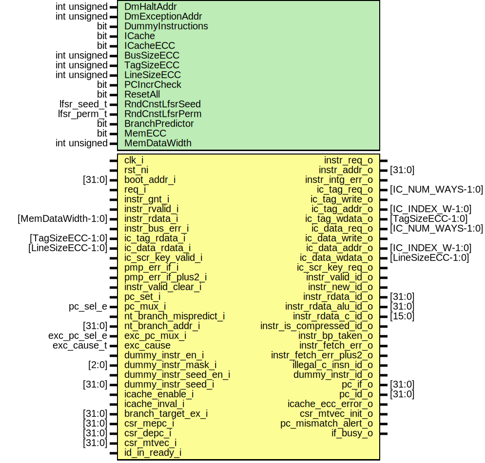

# Entity: ibex_if_stage

- **File**: ibex_if_stage.sv

## Diagram

## Generics

| Generic name      | Type         | Value                  | Description |
| ----------------- | ------------ | ---------------------- | ----------- |
| DmHaltAddr        | int unsigned | 32'h1A110800           |             |
| DmExceptionAddr   | int unsigned | 32'h1A110808           |             |
| DummyInstructions | bit          | 1'b0                   |             |
| ICache            | bit          | 1'b0                   |             |
| ICacheECC         | bit          | 1'b0                   |             |
| BusSizeECC        | int unsigned | BUS_SIZE               |             |
| TagSizeECC        | int unsigned | IC_TAG_SIZE            |             |
| LineSizeECC       | int unsigned | IC_LINE_SIZE           |             |
| PCIncrCheck       | bit          | 1'b0                   |             |
| ResetAll          | bit          | 1'b0                   |             |
| RndCnstLfsrSeed   | lfsr_seed_t  | RndCnstLfsrSeedDefault |             |
| RndCnstLfsrPerm   | lfsr_perm_t  | RndCnstLfsrPermDefault |             |
| BranchPredictor   | bit          | 1'b0                   |             |
| MemECC            | bit          | 1'b0                   |             |
| MemDataWidth      | int unsigned | 32 + 7                 |             |

## Ports

| Port name                | Direction | Type               | Description |
| ------------------------ | --------- | ------------------ | ----------- |
| clk_i                    | input     |                    |             |
| rst_ni                   | input     |                    |             |
| boot_addr_i              | input     | [31:0]             |             |
| req_i                    | input     |                    |             |
| instr_req_o              | output    |                    |             |
| instr_addr_o             | output    | [31:0]             |             |
| instr_gnt_i              | input     |                    |             |
| instr_rvalid_i           | input     |                    |             |
| instr_rdata_i            | input     | [MemDataWidth-1:0] |             |
| instr_bus_err_i          | input     |                    |             |
| instr_intg_err_o         | output    |                    |             |
| ic_tag_req_o             | output    | [IC_NUM_WAYS-1:0]  |             |
| ic_tag_write_o           | output    |                    |             |
| ic_tag_addr_o            | output    | [IC_INDEX_W-1:0]   |             |
| ic_tag_wdata_o           | output    | [TagSizeECC-1:0]   |             |
| ic_tag_rdata_i           | input     | [TagSizeECC-1:0]   |             |
| ic_data_req_o            | output    | [IC_NUM_WAYS-1:0]  |             |
| ic_data_write_o          | output    |                    |             |
| ic_data_addr_o           | output    | [IC_INDEX_W-1:0]   |             |
| ic_data_wdata_o          | output    | [LineSizeECC-1:0]  |             |
| ic_data_rdata_i          | input     | [LineSizeECC-1:0]  |             |
| ic_scr_key_valid_i       | input     |                    |             |
| ic_scr_key_req_o         | output    |                    |             |
| instr_valid_id_o         | output    |                    |             |
| instr_new_id_o           | output    |                    |             |
| instr_rdata_id_o         | output    | [31:0]             |             |
| instr_rdata_alu_id_o     | output    | [31:0]             |             |
| instr_rdata_c_id_o       | output    | [15:0]             |             |
| instr_is_compressed_id_o | output    |                    |             |
| instr_bp_taken_o         | output    |                    |             |
| instr_fetch_err_o        | output    |                    |             |
| instr_fetch_err_plus2_o  | output    |                    |             |
| illegal_c_insn_id_o      | output    |                    |             |
| dummy_instr_id_o         | output    |                    |             |
| pc_if_o                  | output    | [31:0]             |             |
| pc_id_o                  | output    | [31:0]             |             |
| pmp_err_if_i             | input     |                    |             |
| pmp_err_if_plus2_i       | input     |                    |             |
| instr_valid_clear_i      | input     |                    |             |
| pc_set_i                 | input     |                    |             |
| pc_mux_i                 | input     | pc_sel_e           |             |
| nt_branch_mispredict_i   | input     |                    |             |
| nt_branch_addr_i         | input     | [31:0]             |             |
| exc_pc_mux_i             | input     | exc_pc_sel_e       |             |
| exc_cause                | input     | exc_cause_t        |             |
| dummy_instr_en_i         | input     |                    |             |
| dummy_instr_mask_i       | input     | [2:0]              |             |
| dummy_instr_seed_en_i    | input     |                    |             |
| dummy_instr_seed_i       | input     | [31:0]             |             |
| icache_enable_i          | input     |                    |             |
| icache_inval_i           | input     |                    |             |
| icache_ecc_error_o       | output    |                    |             |
| branch_target_ex_i       | input     | [31:0]             |             |
| csr_mepc_i               | input     | [31:0]             |             |
| csr_depc_i               | input     | [31:0]             |             |
| csr_mtvec_i              | input     | [31:0]             |             |
| csr_mtvec_init_o         | output    |                    |             |
| id_in_ready_i            | input     |                    |             |
| pc_mismatch_alert_o      | output    |                    |             |
| if_busy_o                | output    |                    |             |

## Signals

| Name                    | Type               | Description |
| ----------------------- | ------------------ | ----------- |
| instr_valid_id_d        | logic              |             |
| instr_valid_id_q        | logic              |             |
| instr_new_id_d          | logic              |             |
| instr_new_id_q          | logic              |             |
| instr_err               | logic              |             |
| instr_intg_err          | logic              |             |
| prefetch_busy           | logic              |             |
| branch_req              | logic              |             |
| fetch_addr_n            | logic [31:0]       |             |
| unused_fetch_addr_n0    | logic              |             |
| prefetch_branch         | logic              |             |
| prefetch_addr           | logic [31:0]       |             |
| fetch_valid_raw         | logic              |             |
| fetch_valid             | logic              |             |
| fetch_ready             | logic              |             |
| fetch_rdata             | logic [31:0]       |             |
| fetch_addr              | logic [31:0]       |             |
| fetch_err               | logic              |             |
| fetch_err_plus2         | logic              |             |
| instr_decompressed      | logic [31:0]       |             |
| illegal_c_insn          | logic              |             |
| instr_is_compressed     | logic              |             |
| if_instr_valid          | logic              |             |
| if_instr_rdata          | logic [31:0]       |             |
| if_instr_addr           | logic [31:0]       |             |
| if_instr_bus_err        | logic              |             |
| if_instr_pmp_err        | logic              |             |
| if_instr_err            | logic              |             |
| if_instr_err_plus2      | logic              |             |
| exc_pc                  | logic [31:0]       |             |
| if_id_pipe_reg_we       | logic              |             |
| stall_dummy_instr       | logic              |             |
| instr_out               | logic [31:0]       |             |
| instr_is_compressed_out | logic              |             |
| illegal_c_instr_out     | logic              |             |
| instr_err_out           | logic              |             |
| predict_branch_taken    | logic              |             |
| predict_branch_pc       | logic [31:0]       |             |
| irq_vec                 | logic [4:0]        |             |
| pc_mux_internal         | ibex_pkg::pc_sel_e |             |
| unused_boot_addr        | logic [7:0]        |             |
| unused_csr_mtvec        | logic [7:0]        |             |
| unused_exc_cause        | logic              |             |
| assign                  | end                |             |

## Functions

- simutil_get_scramble_key (output bit [127:0]) return (int)
- simutil_get_scramble_nonce (output bit [319:0]) return (int)

## Processes

- exc_pc_mux: ( )
  - **Type:** always_comb
- fetch_addr_mux: ( )
  - **Type:** always_comb
- unnamed: ( @(posedge clk_i or negedge rst_ni) )
  - **Type:** always_ff

## Instantiations

- compressed_decoder_i: ibex_compressed_decoder
