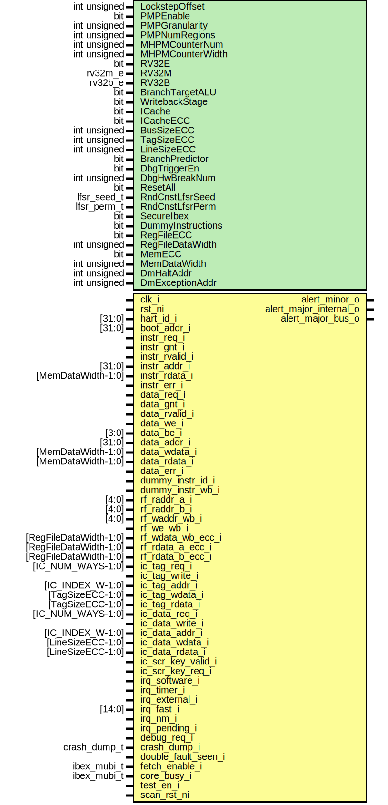

# Entity: ibex_lockstep

- **File**: ibex_lockstep.sv

## Diagram

## Generics

| Generic name      | Type         | Value                  | Description |
| ----------------- | ------------ | ---------------------- | ----------- |
| LockstepOffset    | int unsigned | 2                      |             |
| PMPEnable         | bit          | 1'b0                   |             |
| PMPGranularity    | int unsigned | 0                      |             |
| PMPNumRegions     | int unsigned | 4                      |             |
| MHPMCounterNum    | int unsigned | 0                      |             |
| MHPMCounterWidth  | int unsigned | 40                     |             |
| RV32E             | bit          | 1'b0                   |             |
| RV32M             | rv32m_e      | RV32MFast              |             |
| RV32B             | rv32b_e      | RV32BNone              |             |
| BranchTargetALU   | bit          | 1'b0                   |             |
| WritebackStage    | bit          | 1'b0                   |             |
| ICache            | bit          | 1'b0                   |             |
| ICacheECC         | bit          | 1'b0                   |             |
| BusSizeECC        | int unsigned | BUS_SIZE               |             |
| TagSizeECC        | int unsigned | IC_TAG_SIZE            |             |
| LineSizeECC       | int unsigned | IC_LINE_SIZE           |             |
| BranchPredictor   | bit          | 1'b0                   |             |
| DbgTriggerEn      | bit          | 1'b0                   |             |
| DbgHwBreakNum     | int unsigned | 1                      |             |
| ResetAll          | bit          | 1'b0                   |             |
| RndCnstLfsrSeed   | lfsr_seed_t  | RndCnstLfsrSeedDefault |             |
| RndCnstLfsrPerm   | lfsr_perm_t  | RndCnstLfsrPermDefault |             |
| SecureIbex        | bit          | 1'b0                   |             |
| DummyInstructions | bit          | 1'b0                   |             |
| RegFileECC        | bit          | 1'b0                   |             |
| RegFileDataWidth  | int unsigned | 32                     |             |
| MemECC            | bit          | 1'b0                   |             |
| MemDataWidth      | int unsigned | 32 + 7                 |             |
| DmHaltAddr        | int unsigned | 32'h1A110800           |             |
| DmExceptionAddr   | int unsigned | 32'h1A110808           |             |

## Ports

| Port name              | Direction | Type                   | Description |
| ---------------------- | --------- | ---------------------- | ----------- |
| clk_i                  | input     |                        |             |
| rst_ni                 | input     |                        |             |
| hart_id_i              | input     | [31:0]                 |             |
| boot_addr_i            | input     | [31:0]                 |             |
| instr_req_i            | input     |                        |             |
| instr_gnt_i            | input     |                        |             |
| instr_rvalid_i         | input     |                        |             |
| instr_addr_i           | input     | [31:0]                 |             |
| instr_rdata_i          | input     | [MemDataWidth-1:0]     |             |
| instr_err_i            | input     |                        |             |
| data_req_i             | input     |                        |             |
| data_gnt_i             | input     |                        |             |
| data_rvalid_i          | input     |                        |             |
| data_we_i              | input     |                        |             |
| data_be_i              | input     | [3:0]                  |             |
| data_addr_i            | input     | [31:0]                 |             |
| data_wdata_i           | input     | [MemDataWidth-1:0]     |             |
| data_rdata_i           | input     | [MemDataWidth-1:0]     |             |
| data_err_i             | input     |                        |             |
| dummy_instr_id_i       | input     |                        |             |
| dummy_instr_wb_i       | input     |                        |             |
| rf_raddr_a_i           | input     | [4:0]                  |             |
| rf_raddr_b_i           | input     | [4:0]                  |             |
| rf_waddr_wb_i          | input     | [4:0]                  |             |
| rf_we_wb_i             | input     |                        |             |
| rf_wdata_wb_ecc_i      | input     | [RegFileDataWidth-1:0] |             |
| rf_rdata_a_ecc_i       | input     | [RegFileDataWidth-1:0] |             |
| rf_rdata_b_ecc_i       | input     | [RegFileDataWidth-1:0] |             |
| ic_tag_req_i           | input     | [IC_NUM_WAYS-1:0]      |             |
| ic_tag_write_i         | input     |                        |             |
| ic_tag_addr_i          | input     | [IC_INDEX_W-1:0]       |             |
| ic_tag_wdata_i         | input     | [TagSizeECC-1:0]       |             |
| ic_tag_rdata_i         | input     | [TagSizeECC-1:0]       |             |
| ic_data_req_i          | input     | [IC_NUM_WAYS-1:0]      |             |
| ic_data_write_i        | input     |                        |             |
| ic_data_addr_i         | input     | [IC_INDEX_W-1:0]       |             |
| ic_data_wdata_i        | input     | [LineSizeECC-1:0]      |             |
| ic_data_rdata_i        | input     | [LineSizeECC-1:0]      |             |
| ic_scr_key_valid_i     | input     |                        |             |
| ic_scr_key_req_i       | input     |                        |             |
| irq_software_i         | input     |                        |             |
| irq_timer_i            | input     |                        |             |
| irq_external_i         | input     |                        |             |
| irq_fast_i             | input     | [14:0]                 |             |
| irq_nm_i               | input     |                        |             |
| irq_pending_i          | input     |                        |             |
| debug_req_i            | input     |                        |             |
| crash_dump_i           | input     | crash_dump_t           |             |
| double_fault_seen_i    | input     |                        |             |
| fetch_enable_i         | input     | ibex_mubi_t            |             |
| alert_minor_o          | output    |                        |             |
| alert_major_internal_o | output    |                        |             |
| alert_major_bus_o      | output    |                        |             |
| core_busy_i            | input     | ibex_mubi_t            |             |
| test_en_i              | input     |                        |             |
| scan_rst_ni            | input     |                        |             |

## Signals

| Name                        | Type                                  | Description |
| --------------------------- | ------------------------------------- | ----------- |
| rst_shadow_cnt_d            | logic [LockstepOffsetW-1:0]           |             |
| rst_shadow_cnt_q            | logic [LockstepOffsetW-1:0]           |             |
| rst_shadow_cnt_incr         | logic [LockstepOffsetW-1:0]           |             |
| rst_shadow_set_d            | logic                                 |             |
| rst_shadow_set_q            | logic                                 |             |
| rst_shadow_n                | logic                                 |             |
| enable_cmp_q                | logic                                 |             |
| shadow_inputs_q             | delayed_inputs_t [LockstepOffset-1:0] |             |
| shadow_inputs_in            | delayed_inputs_t                      |             |
| shadow_tag_rdata_q          | logic [TagSizeECC-1:0]                |             |
| shadow_data_rdata_q         | logic [LineSizeECC-1:0]               |             |
| core_outputs_q              | delayed_outputs_t [OutputsOffset-1:0] |             |
| core_outputs_in             | delayed_outputs_t                     |             |
| shadow_outputs_d            | delayed_outputs_t                     |             |
| shadow_outputs_q            | delayed_outputs_t                     |             |
| shadow_alert_minor          | logic                                 |             |
| shadow_alert_major_internal | logic                                 |             |
| shadow_alert_major_bus      | logic                                 |             |
| outputs_mismatch            | logic                                 |             |

## Constants

| Name            | Type         | Value                  | Description |
| --------------- | ------------ | ---------------------- | ----------- |
| LockstepOffsetW | int unsigned | $clog2(LockstepOffset) |             |
| OutputsOffset   | int unsigned | LockstepOffset + 1     |             |

## Types

| Name              | Type                                                                                                                                                                                                                                                                                                                                                                                                                                                                                                                                                                                                                                                                                                                                                                                                                                                                                                                                                                                                                                                                                                                                                                                                                                                                                                                                                                                                                                                                                                                                                                                                                                                                                                                                                                                                     | Description |
| ----------------- | -------------------------------------------------------------------------------------------------------------------------------------------------------------------------------------------------------------------------------------------------------------------------------------------------------------------------------------------------------------------------------------------------------------------------------------------------------------------------------------------------------------------------------------------------------------------------------------------------------------------------------------------------------------------------------------------------------------------------------------------------------------------------------------------------------------------------------------------------------------------------------------------------------------------------------------------------------------------------------------------------------------------------------------------------------------------------------------------------------------------------------------------------------------------------------------------------------------------------------------------------------------------------------------------------------------------------------------------------------------------------------------------------------------------------------------------------------------------------------------------------------------------------------------------------------------------------------------------------------------------------------------------------------------------------------------------------------------------------------------------------------------------------------------------------------- | ----------- |
| delayed_inputs_t  | struct packed {  logic instr_gnt;  logic instr_rvalid;  logic [MemDataWidth-1:0] instr_rdata;  logic instr_err;  logic data_gnt;  logic data_rvalid;  logic [MemDataWidth-1:0] data_rdata;  logic data_err;  logic [RegFileDataWidth-1:0] rf_rdata_a_ecc;  logic [RegFileDataWidth-1:0] rf_rdata_b_ecc;  logic irq_software;  logic irq_timer;  logic irq_external;  logic [14:0] irq_fast;  logic irq_nm;  logic debug_req;  ibex_mubi_t fetch_enable;  logic ic_scr_key_valid;  }                                                                                                                                                                                                                                                                                                                                                                                                                                                                                                                                                                                                                             |             |
| delayed_outputs_t | struct packed {  logic instr_req;  logic [31:0] instr_addr;  logic data_req;  logic data_we;  logic [3:0] data_be;  logic [31:0] data_addr;  logic [MemDataWidth-1:0] data_wdata;  logic dummy_instr_id;  logic dummy_instr_wb;  logic [4:0] rf_raddr_a;  logic [4:0] rf_raddr_b;  logic [4:0] rf_waddr_wb;  logic rf_we_wb;  logic [RegFileDataWidth-1:0] rf_wdata_wb_ecc;  logic [IC_NUM_WAYS-1:0] ic_tag_req;  logic ic_tag_write;  logic [IC_INDEX_W-1:0] ic_tag_addr;  logic [TagSizeECC-1:0] ic_tag_wdata;  logic [IC_NUM_WAYS-1:0] ic_data_req;  logic ic_data_write;  logic [IC_INDEX_W-1:0] ic_data_addr;  logic [LineSizeECC-1:0] ic_data_wdata;  logic ic_scr_key_req;  logic irq_pending;  crash_dump_t crash_dump;  logic double_fault_seen;  ibex_mubi_t core_busy;  } |             |

## Processes

- unnamed: ( @(posedge clk_i or negedge rst_ni) )
  - **Type:** always_ff
- unnamed: ( @(posedge clk_i or negedge rst_ni) )
  - **Type:** always_ff
- unnamed: ( @(posedge clk_i) )
  - **Type:** always_ff
- unnamed: ( @(posedge clk_i) )
  - **Type:** always_ff

## Instantiations

- u_prim_rst_shadow_set_flop: prim_flop
- u_prim_rst_shadow_n_mux2: prim_clock_mux2
