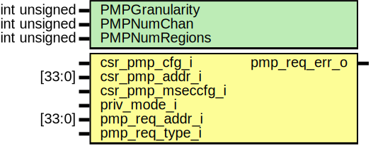

# Entity: ibex_pmp

- **File**: ibex_pmp.sv

## Diagram

## Generics

| Generic name   | Type         | Value | Description |
| -------------- | ------------ | ----- | ----------- |
| PMPGranularity | int unsigned | 0     |             |
| PMPNumChan     | int unsigned | 2     |             |
| PMPNumRegions  | int unsigned | 4     |             |

## Ports

| Port name         | Direction | Type   | Description |
| ----------------- | --------- | ------ | ----------- |
| csr_pmp_cfg_i     | input     |        |             |
| csr_pmp_addr_i    | input     | [33:0] |             |
| csr_pmp_mseccfg_i | input     |        |             |
| priv_mode_i       | input     |        |             |
| pmp_req_addr_i    | input     | [33:0] |             |
| pmp_req_type_i    | input     |        |             |
| pmp_req_err_o     | output    |        |             |

## Signals

| Name                              | Type                                      | Description |
| --------------------------------- | ----------------------------------------- | ----------- |
| region_start_addr [PMPNumRegions] | logic [33:0]                              |             |
| region_addr_mask [PMPNumRegions]  | logic [33:PMPGranularity+2]               |             |
| region_match_gt                   | logic [PMPNumChan-1:0][PMPNumRegions-1:0] |             |
| region_match_lt                   | logic [PMPNumChan-1:0][PMPNumRegions-1:0] |             |
| region_match_eq                   | logic [PMPNumChan-1:0][PMPNumRegions-1:0] |             |
| region_match_all                  | logic [PMPNumChan-1:0][PMPNumRegions-1:0] |             |
| region_basic_perm_check           | logic [PMPNumChan-1:0][PMPNumRegions-1:0] |             |
| region_perm_check                 | logic [PMPNumChan-1:0][PMPNumRegions-1:0] |             |

## Functions

- perm*check_wrapper (logic csr_pmp_mseccfg*) return (logic)
- mml_perm_check (ibex_pkg::pmp_cfg_t csr_pmp_cfg, ) return (logic)
- orig_perm_check (logic pmp_cfg_lock, ) return (logic)
- access*fault_check (logic csr_pmp_mseccfg*) return (logic)
