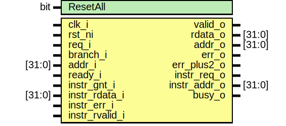

# Entity: ibex_prefetch_buffer

- **File**: ibex_prefetch_buffer.sv

## Diagram

## Generics

| Generic name | Type | Value | Description |
| ------------ | ---- | ----- | ----------- |
| ResetAll     | bit  | 1'b0  |             |

## Ports

| Port name      | Direction | Type   | Description |
| -------------- | --------- | ------ | ----------- |
| clk_i          | input     |        |             |
| rst_ni         | input     |        |             |
| req_i          | input     |        |             |
| branch_i       | input     |        |             |
| addr_i         | input     | [31:0] |             |
| ready_i        | input     |        |             |
| valid_o        | output    |        |             |
| rdata_o        | output    | [31:0] |             |
| addr_o         | output    | [31:0] |             |
| err_o          | output    |        |             |
| err_plus2_o    | output    |        |             |
| instr_req_o    | output    |        |             |
| instr_gnt_i    | input     |        |             |
| instr_addr_o   | output    | [31:0] |             |
| instr_rdata_i  | input     | [31:0] |             |
| instr_err_i    | input     |        |             |
| instr_rvalid_i | input     |        |             |
| busy_o         | output    |        |             |

## Signals

| Name                  | Type                 | Description |
| --------------------- | -------------------- | ----------- |
| valid_new_req         | logic                |             |
| valid_req             | logic                |             |
| valid_req_d           | logic                |             |
| valid_req_q           | logic                |             |
| discard_req_d         | logic                |             |
| discard_req_q         | logic                |             |
| rdata_outstanding_n   | logic [NUM_REQS-1:0] |             |
| rdata_outstanding_s   | logic [NUM_REQS-1:0] |             |
| rdata_outstanding_q   | logic [NUM_REQS-1:0] |             |
| branch_discard_n      | logic [NUM_REQS-1:0] |             |
| branch_discard_s      | logic [NUM_REQS-1:0] |             |
| branch_discard_q      | logic [NUM_REQS-1:0] |             |
| rdata_outstanding_rev | logic [NUM_REQS-1:0] |             |
| stored_addr_d         | logic [31:0]         |             |
| stored_addr_q         | logic [31:0]         |             |
| stored_addr_en        | logic                |             |
| fetch_addr_d          | logic [31:0]         |             |
| fetch_addr_q          | logic [31:0]         |             |
| fetch_addr_en         | logic                |             |
| instr_addr            | logic [31:0]         |             |
| instr_addr_w_aligned  | logic [31:0]         |             |
| fifo_valid            | logic                |             |
| fifo_addr             | logic [31:0]         |             |
| fifo_ready            | logic                |             |
| fifo_clear            | logic                |             |
| fifo_busy             | logic [NUM_REQS-1:0] |             |

## Constants

| Name     | Type | Value | Description |
| -------- | ---- | ----- | ----------- |
| NUM_REQS |      | 2     |             |

## Processes

- unnamed: ( @(posedge clk_i or negedge rst_ni) )
  - **Type:** always_ff

## Instantiations

- fifo_i: ibex_fetch_fifo
