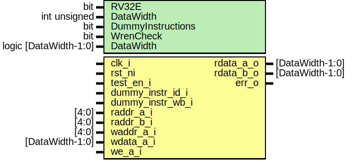

# Entity: ibex_register_file_ff

- **File**: ibex_register_file_ff.sv

## Diagram

## Generics

| Generic name      | Type                  | Value | Description |
| ----------------- | --------------------- | ----- | ----------- |
| RV32E             | bit                   | 0     |             |
| DataWidth         | int unsigned          | 32    |             |
| DummyInstructions | bit                   | 0     |             |
| WrenCheck         | bit                   | 0     |             |
| DataWidth         | logic [DataWidth-1:0] | '0    |             |

## Ports

| Port name        | Direction | Type            | Description |
| ---------------- | --------- | --------------- | ----------- |
| clk_i            | input     |                 |             |
| rst_ni           | input     |                 |             |
| test_en_i        | input     |                 |             |
| dummy_instr_id_i | input     |                 |             |
| dummy_instr_wb_i | input     |                 |             |
| raddr_a_i        | input     | [4:0]           |             |
| rdata_a_o        | output    | [DataWidth-1:0] |             |
| raddr_b_i        | input     | [4:0]           |             |
| rdata_b_o        | output    | [DataWidth-1:0] |             |
| waddr_a_i        | input     | [4:0]           |             |
| wdata_a_i        | input     | [DataWidth-1:0] |             |
| we_a_i           | input     |                 |             |
| err_o            | output    |                 |             |

## Signals

| Name               | Type                  | Description |
| ------------------ | --------------------- | ----------- |
| rf_reg [NUM_WORDS] | logic [DataWidth-1:0] |             |
| we_a_dec           | logic [NUM_WORDS-1:0] |             |
| unused_test_en     | logic                 |             |

## Constants

| Name       | Type | Value           | Description |
| ---------- | ---- | --------------- | ----------- |
| ADDR_WIDTH |      | RV32E ? 4 : 5   |             |
| NUM_WORDS  |      | 2\*\*ADDR_WIDTH |             |

## Processes

- we_a_decoder: ( )
  - **Type:** always_comb
