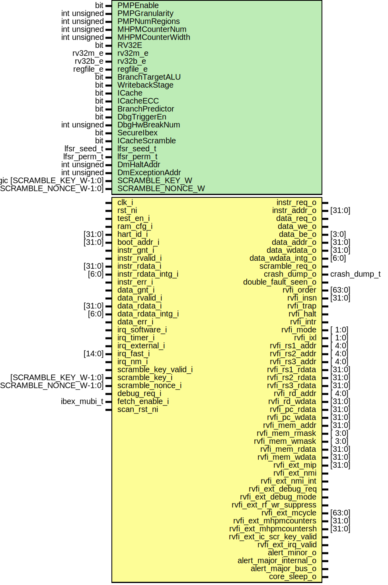

# Entity: ibex_top

- **File**: ibex_top.sv

## Diagram

## Generics

| Generic name     | Type                         | Value                   | Description |
| ---------------- | ---------------------------- | ----------------------- | ----------- |
| PMPEnable        | bit                          | 1'b0                    |             |
| PMPGranularity   | int unsigned                 | 0                       |             |
| PMPNumRegions    | int unsigned                 | 4                       |             |
| MHPMCounterNum   | int unsigned                 | 0                       |             |
| MHPMCounterWidth | int unsigned                 | 40                      |             |
| RV32E            | bit                          | 1'b0                    |             |
| rv32m_e          | rv32m_e                      | RV32MFast               |             |
| rv32b_e          | rv32b_e                      | RV32BNone               |             |
| regfile_e        | regfile_e                    | RegFileFF               |             |
| BranchTargetALU  | bit                          | 1'b0                    |             |
| WritebackStage   | bit                          | 1'b0                    |             |
| ICache           | bit                          | 1'b0                    |             |
| ICacheECC        | bit                          | 1'b0                    |             |
| BranchPredictor  | bit                          | 1'b0                    |             |
| DbgTriggerEn     | bit                          | 1'b0                    |             |
| DbgHwBreakNum    | int unsigned                 | 1                       |             |
| SecureIbex       | bit                          | 1'b0                    |             |
| ICacheScramble   | bit                          | 1'b0                    |             |
| lfsr_seed_t      | lfsr_seed_t                  | RndCnstLfsrSeedDefault  |             |
| lfsr_perm_t      | lfsr_perm_t                  | RndCnstLfsrPermDefault  |             |
| DmHaltAddr       | int unsigned                 | 32'h1A110800            |             |
| DmExceptionAddr  | int unsigned                 | 32'h1A110808            |             |
| SCRAMBLE_KEY_W   | logic [SCRAMBLE_KEY_W-1:0]   | RndCnstIbexKeyDefault   |             |
| SCRAMBLE_NONCE_W | logic [SCRAMBLE_NONCE_W-1:0] | RndCnstIbexNonceDefault |             |

## Ports

| Port name                 | Direction | Type                   | Description |
| ------------------------- | --------- | ---------------------- | ----------- |
| clk_i                     | input     |                        |             |
| rst_ni                    | input     |                        |             |
| test_en_i                 | input     |                        |             |
| ram_cfg_i                 | input     |                        |             |
| hart_id_i                 | input     | [31:0]                 |             |
| boot_addr_i               | input     | [31:0]                 |             |
| instr_req_o               | output    |                        |             |
| instr_gnt_i               | input     |                        |             |
| instr_rvalid_i            | input     |                        |             |
| instr_addr_o              | output    | [31:0]                 |             |
| instr_rdata_i             | input     | [31:0]                 |             |
| instr_rdata_intg_i        | input     | [6:0]                  |             |
| instr_err_i               | input     |                        |             |
| data_req_o                | output    |                        |             |
| data_gnt_i                | input     |                        |             |
| data_rvalid_i             | input     |                        |             |
| data_we_o                 | output    |                        |             |
| data_be_o                 | output    | [3:0]                  |             |
| data_addr_o               | output    | [31:0]                 |             |
| data_wdata_o              | output    | [31:0]                 |             |
| data_wdata_intg_o         | output    | [6:0]                  |             |
| data_rdata_i              | input     | [31:0]                 |             |
| data_rdata_intg_i         | input     | [6:0]                  |             |
| data_err_i                | input     |                        |             |
| irq_software_i            | input     |                        |             |
| irq_timer_i               | input     |                        |             |
| irq_external_i            | input     |                        |             |
| irq_fast_i                | input     | [14:0]                 |             |
| irq_nm_i                  | input     |                        |             |
| scramble_key_valid_i      | input     |                        |             |
| scramble_key_i            | input     | [SCRAMBLE_KEY_W-1:0]   |             |
| scramble_nonce_i          | input     | [SCRAMBLE_NONCE_W-1:0] |             |
| scramble_req_o            | output    |                        |             |
| debug_req_i               | input     |                        |             |
| crash_dump_o              | output    | crash_dump_t           |             |
| double_fault_seen_o       | output    |                        |             |
| rvfi_valid                |           |                        |             |
| rvfi_order                | output    | [63:0]                 |             |
| rvfi_insn                 | output    | [31:0]                 |             |
| rvfi_trap                 | output    |                        |             |
| rvfi_halt                 | output    |                        |             |
| rvfi_intr                 | output    |                        |             |
| rvfi_mode                 | output    | [ 1:0]                 |             |
| rvfi_ixl                  | output    | [ 1:0]                 |             |
| rvfi_rs1_addr             | output    | [ 4:0]                 |             |
| rvfi_rs2_addr             | output    | [ 4:0]                 |             |
| rvfi_rs3_addr             | output    | [ 4:0]                 |             |
| rvfi_rs1_rdata            | output    | [31:0]                 |             |
| rvfi_rs2_rdata            | output    | [31:0]                 |             |
| rvfi_rs3_rdata            | output    | [31:0]                 |             |
| rvfi_rd_addr              | output    | [ 4:0]                 |             |
| rvfi_rd_wdata             | output    | [31:0]                 |             |
| rvfi_pc_rdata             | output    | [31:0]                 |             |
| rvfi_pc_wdata             | output    | [31:0]                 |             |
| rvfi_mem_addr             | output    | [31:0]                 |             |
| rvfi_mem_rmask            | output    | [ 3:0]                 |             |
| rvfi_mem_wmask            | output    | [ 3:0]                 |             |
| rvfi_mem_rdata            | output    | [31:0]                 |             |
| rvfi_mem_wdata            | output    | [31:0]                 |             |
| rvfi_ext_mip              | output    | [31:0]                 |             |
| rvfi_ext_nmi              | output    |                        |             |
| rvfi_ext_nmi_int          | output    |                        |             |
| rvfi_ext_debug_req        | output    |                        |             |
| rvfi_ext_debug_mode       | output    |                        |             |
| rvfi_ext_rf_wr_suppress   | output    |                        |             |
| rvfi_ext_mcycle           | output    | [63:0]                 |             |
| rvfi_ext_mhpmcounters     | output    | [31:0]                 |             |
| rvfi_ext_mhpmcountersh    | output    | [31:0]                 |             |
| rvfi_ext_ic_scr_key_valid | output    |                        |             |
| rvfi_ext_irq_valid        | output    |                        |             |
| fetch_enable_i            | input     | ibex_mubi_t            |             |
| alert_minor_o             | output    |                        |             |
| alert_major_internal_o    | output    |                        |             |
| alert_major_bus_o         | output    |                        |             |
| core_sleep_o              | output    |                        |             |
| scan_rst_ni               | input     |                        |             |

## Signals

| Name                             | Type                               | Description |
| -------------------------------- | ---------------------------------- | ----------- |
| clk                              | logic                              |             |
| clock_en                         | logic                              |             |
| irq_pending                      | logic                              |             |
| dummy_instr_id                   | logic                              |             |
| dummy_instr_wb                   | logic                              |             |
| rf_raddr_a                       | logic [4:0]                        |             |
| rf_raddr_b                       | logic [4:0]                        |             |
| rf_waddr_wb                      | logic [4:0]                        |             |
| rf_we_wb                         | logic                              |             |
| rf_wdata_wb_ecc                  | logic [RegFileDataWidth-1:0]       |             |
| rf_rdata_a_ecc                   | logic [RegFileDataWidth-1:0]       |             |
| rf_rdata_a_ecc_buf               | logic [RegFileDataWidth-1:0]       |             |
| rf_rdata_b_ecc                   | logic [RegFileDataWidth-1:0]       |             |
| rf_rdata_b_ecc_buf               | logic [RegFileDataWidth-1:0]       |             |
| data_wdata_core                  | logic [MemDataWidth-1:0]           |             |
| data_rdata_core                  | logic [MemDataWidth-1:0]           |             |
| instr_rdata_core                 | logic [MemDataWidth-1:0]           |             |
| ic_tag_req                       | logic [IC_NUM_WAYS-1:0]            |             |
| ic_tag_write                     | logic                              |             |
| ic_tag_addr                      | logic [IC_INDEX_W-1:0]             |             |
| ic_tag_wdata                     | logic [TagSizeECC-1:0]             |             |
| ic_tag_rdata [IC_NUM_WAYS]       | logic [TagSizeECC-1:0]             |             |
| ic_data_req                      | logic [IC_NUM_WAYS-1:0]            |             |
| ic_data_write                    | logic                              |             |
| ic_data_addr                     | logic [IC_INDEX_W-1:0]             |             |
| ic_data_wdata                    | logic [LineSizeECC-1:0]            |             |
| ic_data_rdata [IC_NUM_WAYS]      | logic [LineSizeECC-1:0]            |             |
| ic_scr_key_req                   | logic                              |             |
| core_alert_major_internal        | logic                              |             |
| core_alert_major_bus             | logic                              |             |
| core_alert_minor                 | logic                              |             |
| lockstep_alert_major_internal    | logic                              |             |
| lockstep_alert_major_bus         | logic                              |             |
| lockstep_alert_minor             | logic                              |             |
| scramble_key_q                   | logic [SCRAMBLE_KEY_W-1:0]         |             |
| scramble_nonce_q                 | logic [SCRAMBLE_NONCE_W-1:0]       |             |
| scramble_key_valid_d             | logic                              |             |
| scramble_key_valid_q             | logic                              |             |
| scramble_req_d                   | logic                              |             |
| scramble_req_q                   | logic                              |             |
| rf_alert_major_internal          | logic                              |             |
| double_fault_seen_delay_buffer   | logic [DoubleFaultSeenLatency-1:0] |             |
| double_fault_seen_delay_buffer_q | logic [DoubleFaultSeenLatency-2:0] |             |
| sync_exc_seen                    | logic                              |             |
| new_sync_exc                     | logic                              |             |
| double_fault_seen_predicted      | logic                              |             |

## Constants

| Name                        | Type | Value                                       | Description |
| --------------------------- | ---- | ------------------------------------------- | ----------- |
| Lockstep                    |      | SecureIbex                                  |             |
| ResetAll                    |      | Lockstep                                    |             |
| DummyInstructions           |      | SecureIbex                                  |             |
| RegFileECC                  |      | SecureIbex                                  |             |
| RegFileWrenCheck            |      | SecureIbex                                  |             |
| RegFileDataWidth            |      | RegFileECC ? 32 + 7 : 32                    |             |
| MemECC                      |      | SecureIbex                                  |             |
| MemDataWidth                |      | MemECC ? 32 + 7 : 32                        |             |
| BusSizeECC                  |      | ICacheECC ? (BUS_SIZE + 7) : BUS_SIZE       |             |
| LineSizeECC                 |      | BusSizeECC \* IC_LINE_BEATS                 |             |
| TagSizeECC                  |      | ICacheECC ? (IC_TAG_SIZE + 6) : IC_TAG_SIZE |             |
| NumAddrScrRounds            |      | ICacheScramble ? 2 : 0                      |             |
| NumDiffRounds               |      | NumAddrScrRounds                            |             |
| MaxOutstandingDSideAccesses |      | 2                                           |             |
| DoubleFaultSeenLatency      |      | 3                                           |             |

## Functions

- insn_write_sync_exc_seen (logic [31:0] insn_bits) return (logic)
- new_sync_exc_bit () return (logic)

## Processes

- unnamed: ( @(posedge clk_i or negedge rst_ni) )
  - **Type:** always

## Instantiations

- core_clock_gate_i: prim_clock_gating
- u_fetch_enable_buf: prim_buf
- u_rf_rdata_a_ecc_buf: prim_buf
- u_rf_rdata_b_ecc_buf: prim_buf
