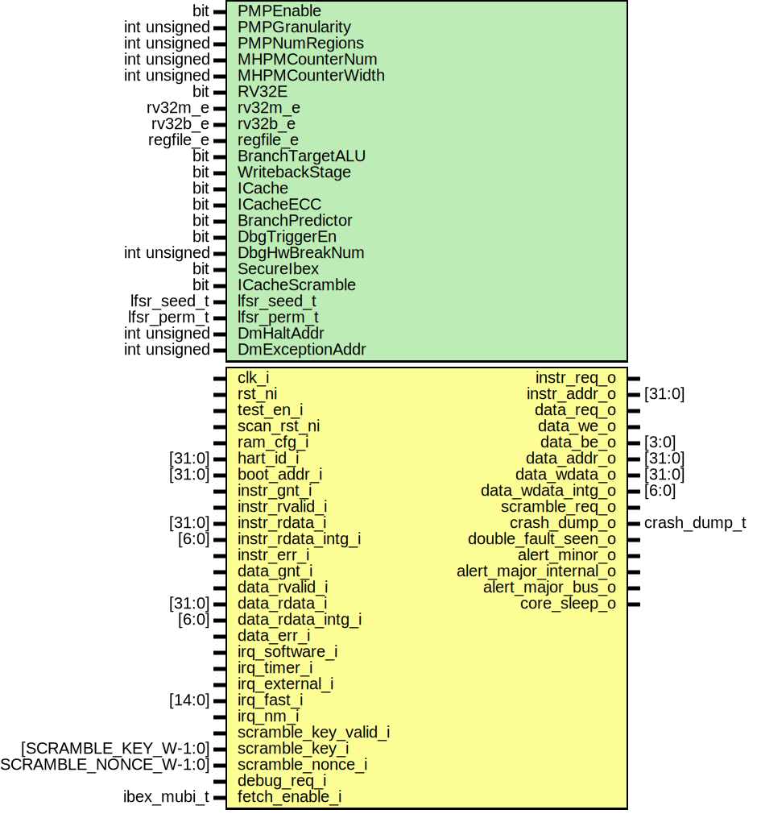

# Entity: ibex_top_tracing

- **File**: ibex_top_tracing.sv

## Diagram

## Generics

| Generic name     | Type         | Value                  | Description |
| ---------------- | ------------ | ---------------------- | ----------- |
| PMPEnable        | bit          | 1'b0                   |             |
| PMPGranularity   | int unsigned | 0                      |             |
| PMPNumRegions    | int unsigned | 4                      |             |
| MHPMCounterNum   | int unsigned | 0                      |             |
| MHPMCounterWidth | int unsigned | 40                     |             |
| RV32E            | bit          | 1'b0                   |             |
| rv32m_e          | rv32m_e      | RV32MFast              |             |
| rv32b_e          | rv32b_e      | RV32BNone              |             |
| regfile_e        | regfile_e    | RegFileFF              |             |
| BranchTargetALU  | bit          | 1'b0                   |             |
| WritebackStage   | bit          | 1'b0                   |             |
| ICache           | bit          | 1'b0                   |             |
| ICacheECC        | bit          | 1'b0                   |             |
| BranchPredictor  | bit          | 1'b0                   |             |
| DbgTriggerEn     | bit          | 1'b0                   |             |
| DbgHwBreakNum    | int unsigned | 1                      |             |
| SecureIbex       | bit          | 1'b0                   |             |
| ICacheScramble   | bit          | 1'b0                   |             |
| lfsr_seed_t      | lfsr_seed_t  | RndCnstLfsrSeedDefault |             |
| lfsr_perm_t      | lfsr_perm_t  | RndCnstLfsrPermDefault |             |
| DmHaltAddr       | int unsigned | 32'h1A110800           |             |
| DmExceptionAddr  | int unsigned | 32'h1A110808           |             |

## Ports

| Port name              | Direction | Type                   | Description |
| ---------------------- | --------- | ---------------------- | ----------- |
| clk_i                  | input     |                        |             |
| rst_ni                 | input     |                        |             |
| test_en_i              | input     |                        |             |
| scan_rst_ni            | input     |                        |             |
| ram_cfg_i              | input     |                        |             |
| hart_id_i              | input     | [31:0]                 |             |
| boot_addr_i            | input     | [31:0]                 |             |
| instr_req_o            | output    |                        |             |
| instr_gnt_i            | input     |                        |             |
| instr_rvalid_i         | input     |                        |             |
| instr_addr_o           | output    | [31:0]                 |             |
| instr_rdata_i          | input     | [31:0]                 |             |
| instr_rdata_intg_i     | input     | [6:0]                  |             |
| instr_err_i            | input     |                        |             |
| data_req_o             | output    |                        |             |
| data_gnt_i             | input     |                        |             |
| data_rvalid_i          | input     |                        |             |
| data_we_o              | output    |                        |             |
| data_be_o              | output    | [3:0]                  |             |
| data_addr_o            | output    | [31:0]                 |             |
| data_wdata_o           | output    | [31:0]                 |             |
| data_wdata_intg_o      | output    | [6:0]                  |             |
| data_rdata_i           | input     | [31:0]                 |             |
| data_rdata_intg_i      | input     | [6:0]                  |             |
| data_err_i             | input     |                        |             |
| irq_software_i         | input     |                        |             |
| irq_timer_i            | input     |                        |             |
| irq_external_i         | input     |                        |             |
| irq_fast_i             | input     | [14:0]                 |             |
| irq_nm_i               | input     |                        |             |
| scramble_key_valid_i   | input     |                        |             |
| scramble_key_i         | input     | [SCRAMBLE_KEY_W-1:0]   |             |
| scramble_nonce_i       | input     | [SCRAMBLE_NONCE_W-1:0] |             |
| scramble_req_o         | output    |                        |             |
| debug_req_i            | input     |                        |             |
| crash_dump_o           | output    | crash_dump_t           |             |
| double_fault_seen_o    | output    |                        |             |
| fetch_enable_i         | input     | ibex_mubi_t            |             |
| alert_minor_o          | output    |                        |             |
| alert_major_internal_o | output    |                        |             |
| alert_major_bus_o      | output    |                        |             |
| core_sleep_o           | output    |                        |             |

## Signals

| Name                             | Type         | Description |
| -------------------------------- | ------------ | ----------- |
| rvfi_valid                       | logic        |             |
| rvfi_order                       | logic [63:0] |             |
| rvfi_insn                        | logic [31:0] |             |
| rvfi_trap                        | logic        |             |
| rvfi_halt                        | logic        |             |
| rvfi_intr                        | logic        |             |
| rvfi_mode                        | logic [ 1:0] |             |
| rvfi_ixl                         | logic [ 1:0] |             |
| rvfi_rs1_addr                    | logic [ 4:0] |             |
| rvfi_rs2_addr                    | logic [ 4:0] |             |
| rvfi_rs3_addr                    | logic [ 4:0] |             |
| rvfi_rs1_rdata                   | logic [31:0] |             |
| rvfi_rs2_rdata                   | logic [31:0] |             |
| rvfi_rs3_rdata                   | logic [31:0] |             |
| rvfi_rd_addr                     | logic [ 4:0] |             |
| rvfi_rd_wdata                    | logic [31:0] |             |
| rvfi_pc_rdata                    | logic [31:0] |             |
| rvfi_pc_wdata                    | logic [31:0] |             |
| rvfi_mem_addr                    | logic [31:0] |             |
| rvfi_mem_rmask                   | logic [ 3:0] |             |
| rvfi_mem_wmask                   | logic [ 3:0] |             |
| rvfi_mem_rdata                   | logic [31:0] |             |
| rvfi_mem_wdata                   | logic [31:0] |             |
| rvfi_ext_mip                     | logic [31:0] |             |
| rvfi_ext_nmi                     | logic        |             |
| rvfi_ext_nmi_int                 | logic        |             |
| rvfi_ext_debug_req               | logic        |             |
| rvfi_ext_debug_mode              | logic        |             |
| rvfi_ext_rf_wr_suppress          | logic        |             |
| rvfi_ext_mcycle                  | logic [63:0] |             |
| rvfi_ext_mhpmcounters [10]       | logic [31:0] |             |
| rvfi_ext_mhpmcountersh [10]      | logic [31:0] |             |
| rvfi_ext_ic_scr_key_valid        | logic        |             |
| rvfi_ext_irq_valid               | logic        |             |
| unused_perf_regs [10]            | logic [31:0] |             |
| unused_perf_regsh [10]           | logic [31:0] |             |
| unused_rvfi_ext_mip              | logic [31:0] |             |
| unused_rvfi_ext_nmi              | logic        |             |
| unused_rvfi_ext_nmi_int          | logic        |             |
| unused_rvfi_ext_debug_req        | logic        |             |
| unused_rvfi_ext_debug_mode       | logic        |             |
| unused_rvfi_ext_rf_wr_suppress   | logic        |             |
| unused_rvfi_ext_mcycle           | logic [63:0] |             |
| unused_rvfi_ext_ic_scr_key_valid | logic        |             |
| unused_rvfi_ext_irq_valid        | logic        |             |

## Instantiations

- u_ibex_top: ibex_top
