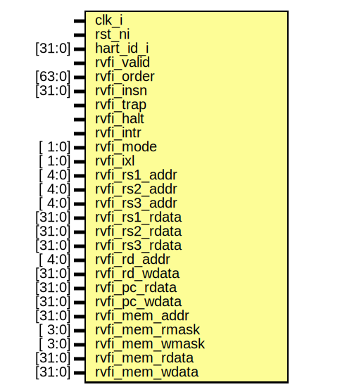

# Entity: ibex_tracer

- **File**: ibex_tracer.sv

## Diagram

## Ports

| Port name      | Direction | Type   | Description |
| -------------- | --------- | ------ | ----------- |
| clk_i          | input     |        |             |
| rst_ni         | input     |        |             |
| hart_id_i      | input     | [31:0] |             |
| rvfi_valid     | input     |        |             |
| rvfi_order     | input     | [63:0] |             |
| rvfi_insn      | input     | [31:0] |             |
| rvfi_trap      | input     |        |             |
| rvfi_halt      | input     |        |             |
| rvfi_intr      | input     |        |             |
| rvfi_mode      | input     | [ 1:0] |             |
| rvfi_ixl       | input     | [ 1:0] |             |
| rvfi_rs1_addr  | input     | [ 4:0] |             |
| rvfi_rs2_addr  | input     | [ 4:0] |             |
| rvfi_rs3_addr  | input     | [ 4:0] |             |
| rvfi_rs1_rdata | input     | [31:0] |             |
| rvfi_rs2_rdata | input     | [31:0] |             |
| rvfi_rs3_rdata | input     | [31:0] |             |
| rvfi_rd_addr   | input     | [ 4:0] |             |
| rvfi_rd_wdata  | input     | [31:0] |             |
| rvfi_pc_rdata  | input     | [31:0] |             |
| rvfi_pc_wdata  | input     | [31:0] |             |
| rvfi_mem_addr  | input     | [31:0] |             |
| rvfi_mem_rmask | input     | [ 3:0] |             |
| rvfi_mem_wmask | input     | [ 3:0] |             |
| rvfi_mem_rdata | input     | [31:0] |             |
| rvfi_mem_wdata | input     | [31:0] |             |

## Signals

| Name                           | Type         | Description |
| ------------------------------ | ------------ | ----------- |
| unused_rvfi_order = rvfi_order | logic [63:0] |             |
| unused_rvfi_trap = rvfi_trap   | logic        |             |
| unused_rvfi_halt = rvfi_halt   | logic        |             |
| unused_rvfi_intr = rvfi_intr   | logic        |             |
| unused_rvfi_mode = rvfi_mode   | logic [ 1:0] |             |
| unused_rvfi_ixl = rvfi_ixl     | logic [ 1:0] |             |
| file_handle                    | int          |             |
| file_name                      | string       |             |
| cycle                          | int unsigned |             |
| decoded_str                    | string       |             |
| insn_is_compressed             | logic        |             |
| data_accessed                  | logic [4:0]  |             |
| trace_log_enable               | logic        |             |

## Constants

| Name | Type | Value    | Description |
| ---- | ---- | -------- | ----------- |
| RS1  |      | (1 << 0) |             |
| RS2  |      | (1 << 1) |             |
| RS3  |      | (1 << 2) |             |
| RD   |      | (1 << 3) |             |
| MEM  |      | (1 << 4) |             |

## Functions

- printbuffer_dumpline () return (void)
- reg_addr_to_str (input logic [4:0] addr) return (string)
- get_csr_name (input logic [11:0] csr_addr) return (string)
- decode_mnemonic (input string mnemonic) return (void)
- decode_r_insn (input string mnemonic) return (void)
- decode_r1_insn (input string mnemonic) return (void)
- decode_r_cmixcmov_insn (input string mnemonic) return (void)
- decode_r_funnelshift_insn (input string mnemonic) return (void)
- decode_i_insn (input string mnemonic) return (void)
- decode_i_shift_insn (input string mnemonic) return (void)
- decode_i_funnelshift_insn (input string mnemonic) return (void)
- decode_i_jalr_insn (input string mnemonic) return (void)
- decode_u_insn (input string mnemonic) return (void)
- decode_j_insn (input string mnemonic) return (void)
- decode_b_insn (input string mnemonic) return (void)
- decode_csr_insn (input string mnemonic) return (void)
- decode_cr_insn (input string mnemonic) return (void)
- decode_ci_cli_insn (input string mnemonic) return (void)
- decode_ci_caddi_insn (input string mnemonic) return (void)
- decode_ci_caddi16sp_insn (input string mnemonic) return (void)
- decode_ci_clui_insn (input string mnemonic) return (void)
- decode_ci_cslli_insn (input string mnemonic) return (void)
- decode_ciw_insn (input string mnemonic) return (void)
- decode_cb_sr_insn (input string mnemonic) return (void)
- decode_cb_insn (input string mnemonic) return (void)
- decode_cs_insn (input string mnemonic) return (void)
- decode_cj_insn (input string mnemonic) return (void)
- decode_compressed_load_insn (input string mnemonic) return (void)
- decode_compressed_store_insn (input string mnemonic) return (void)
- decode_load_insn () return (void)
- decode_store_insn () return (void)
- get_fence_description (logic [3:0] bits) return (string)
- decode_fence () return (void)

## Processes

- unnamed: ( @(posedge clk_i or negedge rst_ni) )
  - **Type:** always_ff
- unnamed: ( @(posedge clk_i) )
  - **Type:** always_ff
