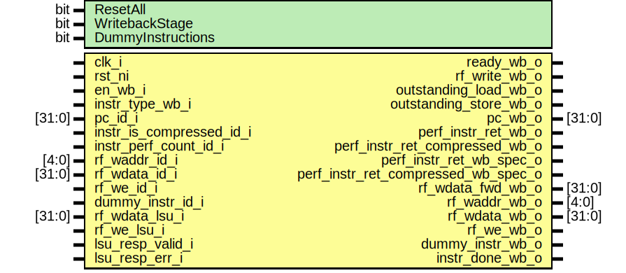

# Entity: ibex_wb_stage

- **File**: ibex_wb_stage.sv

## Diagram

## Generics

| Generic name      | Type | Value | Description |
| ----------------- | ---- | ----- | ----------- |
| ResetAll          | bit  | 1'b0  |             |
| WritebackStage    | bit  | 1'b0  |             |
| DummyInstructions | bit  | 1'b0  |             |

## Ports

| Port name                           | Direction | Type   | Description |
| ----------------------------------- | --------- | ------ | ----------- |
| clk_i                               | input     |        |             |
| rst_ni                              | input     |        |             |
| en_wb_i                             | input     |        |             |
| instr_type_wb_i                     | input     |        |             |
| pc_id_i                             | input     | [31:0] |             |
| instr_is_compressed_id_i            | input     |        |             |
| instr_perf_count_id_i               | input     |        |             |
| ready_wb_o                          | output    |        |             |
| rf_write_wb_o                       | output    |        |             |
| outstanding_load_wb_o               | output    |        |             |
| outstanding_store_wb_o              | output    |        |             |
| pc_wb_o                             | output    | [31:0] |             |
| perf_instr_ret_wb_o                 | output    |        |             |
| perf_instr_ret_compressed_wb_o      | output    |        |             |
| perf_instr_ret_wb_spec_o            | output    |        |             |
| perf_instr_ret_compressed_wb_spec_o | output    |        |             |
| rf_waddr_id_i                       | input     | [4:0]  |             |
| rf_wdata_id_i                       | input     | [31:0] |             |
| rf_we_id_i                          | input     |        |             |
| dummy_instr_id_i                    | input     |        |             |
| rf_wdata_lsu_i                      | input     | [31:0] |             |
| rf_we_lsu_i                         | input     |        |             |
| rf_wdata_fwd_wb_o                   | output    | [31:0] |             |
| rf_waddr_wb_o                       | output    | [4:0]  |             |
| rf_wdata_wb_o                       | output    | [31:0] |             |
| rf_we_wb_o                          | output    |        |             |
| dummy_instr_wb_o                    | output    |        |             |
| lsu_resp_valid_i                    | input     |        |             |
| lsu_resp_err_i                      | input     |        |             |
| instr_done_wb_o                     | output    |        |             |

## Signals

| Name                | Type         | Description |
| ------------------- | ------------ | ----------- |
| rf_wdata_wb_mux [2] | logic [31:0] |             |
| rf_wdata_wb_mux_we  | logic [1:0]  |             |
